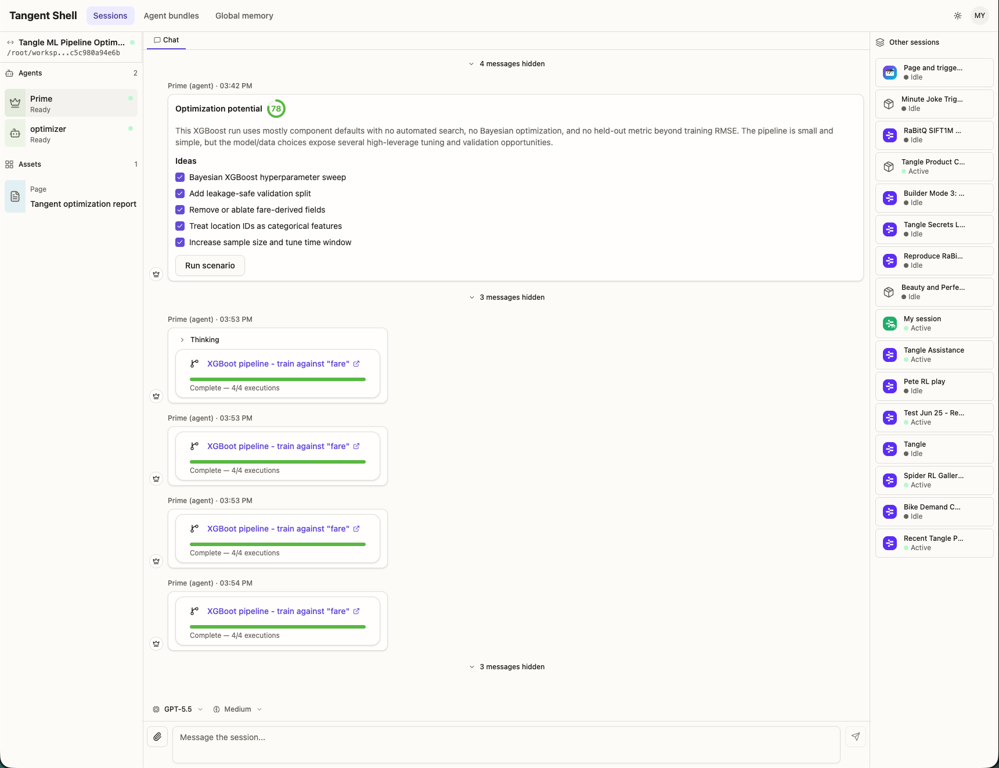
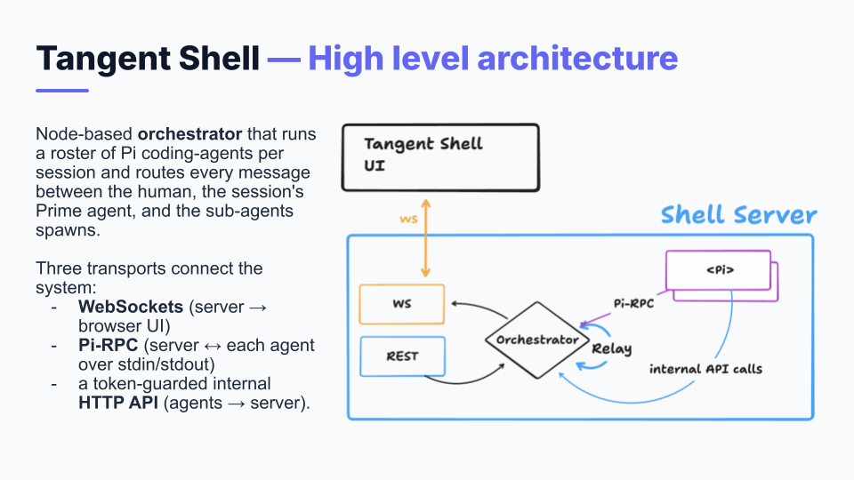

# Tangent Shell

Tangent Shell is a self-hostable platform for running AI agents. Open a **session** and
you get a dedicated workspace with a persistent AI teammate — **Prime** — that can read and
write files, call tools, run code, coordinate helper agents, and remember what it learns.
Drop in an **Agent Bundle** and that session arrives pre-loaded with the prompts, tools,
skills, and custom UI for a specific job.

It is the orchestration front-end of the wider **Tangle** platform: agents here can author
and submit ML pipelines to Tangle for execution, but the shell is useful for any agentic
workflow — research, code generation, document building, scheduled automation, and more.



## Getting started

### Prerequisites

- **Node.js** (the version matching the Docker base image, currently 24+)
- **pnpm** `10.28.0` (the pinned package manager)
- The **`pi`** agent binary on your `PATH` (or set `PI_BIN`; `start_local.sh` installs it for you)
- LLM access for `pi`: a provider key such as `OPENAI_API_KEY` or `ANTHROPIC_API_KEY`, or an
  LLM gateway via `PI_PROXY_URL` / `PI_PROXY_API_KEY` (see below)

### Install and run

```bash
pnpm install
pnpm dev
```

`pnpm dev` sets the session/bundle/memory paths to local gitignored folders (`.sessions`,
`.agent-bundles`, `.memory`) so a checkout runs without extra setup.

Copy `.env.example` to `.env` for local-only provider values. Keep real deployment
URLs, cookies, proxy credentials, and auth endpoints out of committed files; inject them
through your process manager, container platform, or secret manager.

To load the example agent bundles into your local marketplace:

```bash
pnpm seed         # installs bundles from examples
```

## Terminology

- **Sessions** — Isolated workspaces, each with its own folder on disk, chat transcript, and
  agent. Work in one never leaks into another, and everything survives restarts.
- **Live chat** — Stream Prime's replies in real time, with activity indicators for thinking
  and tool calls.
- **Agent Bundles** — Portable `.zip` packages that preconfigure a session with a system
  prompt, tool allowlist, skills, workflows, sub-agent templates, seed memory, triggers, and
  optional custom UI. A handful of ready-to-use bundles ship in [`examples`](examples).
- **Sub-agent orchestration** — Prime delegates work to specialist sub-agents (researcher,
  builder, reviewer, …) that run in parallel in a shared workspace and report back.
- **Memory** — Per-session memory plus a global, cross-session store the agent reads and
  writes. Memory changes the agent suggests are confirmed by you before they stick.
- **Triggers** — Schedule work on a cron or interval, or fire it from an inbound callback.
- **Artifacts** — Files the agent creates (HTML, code, PDFs, …) are surfaced and pinnable in
  the UI.
- **Custom UI** — Bundles can ship React components that render in a sandboxed iframe, giving
  an agent purpose-built input and output panels.

See [`docs/overview`](docs/overview) for a guided tour of each concept.

## Architecture

A pnpm + Turbo monorepo with two apps and shared packages.

```
tangent-shell/
├── apps/
│   ├── server/   Express + Socket.IO orchestrator; spawns and supervises agents
│   └── web/      React 19 + Vite frontend
├── packages/
│   ├── shared/   Wire contracts and the config-bundle format (used by both apps)
│   └── build/    Shared ESLint / TypeScript / Prettier config
├── docs/         Concept guides, server architecture, bundle-UI protocol
├── examples/     Ready-to-use agent bundles
└── docker/       nginx config + entrypoint for the full-stack image
```



### Server (`apps/server`)

Express 5 + Socket.IO over a SQLite database (better-sqlite3) with Drizzle ORM. It is the
composition root that wires together the session store, bundle store, memory manager, and
trigger engine, and it manages the agent lifecycle.

Agents run as **Pi** processes — the `pi` coding agent spawned as a child process and driven
over an stdin/stdout RPC protocol. The server starts one **Prime**
agent per session and spawns sub-agents on demand, streaming their events to the UI over
Socket.IO rooms.

- **REST API** (`/api/*`) — sessions CRUD, file uploads and artifact serving, agent bundles,
  global memory, and current-user lookup.
- **Internal API** (`/internal/*`) — called by agents (guarded by a bearer token) to spawn
  and message sub-agents, read/write memory, manage triggers, and make sandboxed egress
  requests through an allowlist.
- **WebSocket events** — streaming assistant deltas, tool/thinking activity, sub-agent roster
  updates, memory suggestions, trigger updates, and chat messages.

State lives in two places: session **metadata** in SQLite (`sessions`, `sessionAssets`,
`sessionAgents` tables), and per-session **data** on disk — artifacts, uploads, memory files,
and append-only JSONL chat logs under each session's folder. Schema changes are managed with
Drizzle migrations.

See [`docs/server`](docs/server) for the full component map and protocols.

### Web (`apps/web`)

React 19 (with the React Compiler) on Vite, Tailwind v4, TanStack Router and TanStack Query,
and a Socket.IO client for live session state.

Source is organized into `routes/` (pages), `features/*` (sessions, chat, agent-bundles,
global-memory, triggers, user, bundle-ui), and `shared/` (API client, config, and the UI
design system). The UI is a layered design system — base primitives (`BlockStack`, `Text`, …),
semantic Layer-3 patterns (`Surface`, `Card`, `ListRow`, …), and feature components on top.
See [`apps/web/src/shared/ui/DESIGN_SYSTEM.md`](apps/web/src/shared/ui/DESIGN_SYSTEM.md).

## Operation manual

### Configuration

Key environment variables (see [`apps/server/src/config.ts`](apps/server/src/config.ts) for
the full list and defaults):

| Variable                                          | Purpose                                                        |
| ------------------------------------------------- | -------------------------------------------------------------- |
| `PORT`                                            | HTTP server port                                               |
| `SESSIONS_ROOT`                                   | Root directory for per-session workspaces                      |
| `SESSIONS_DB`                                     | SQLite metadata database file                                  |
| `AGENT_BUNDLES_ROOT`                              | Bundle marketplace storage                                     |
| `GLOBAL_MEMORY_DIR`                               | Global (cross-session) memory store                            |
| `PI_BIN`                                          | Path to the `pi` agent executable                              |
| `PI_PROVIDER` / `PI_MODEL` / `PI_THINKING`        | Default LLM provider, model, and thinking level                |
| `PI_PROXY_URL` / `PI_PROXY_API_KEY`               | LLM proxy endpoint and credential                              |
| `TANGLE_API_URL`                                  | Tangle API base URL used by server-side egress targets         |
| `TANGLE_TOKEN`                                    | Optional cookie string injected server-side for egress         |
| `AUTH_JWT_TOKEN_COOKIE_NAME`                      | Optional auth cookie name for `/api/me`                        |
| `TANGENT_INTERNAL_URL` / `TANGENT_INTERNAL_TOKEN` | Internal agent API URL and bearer token                        |
| `INSTANCE_PROXY_URL`                              | Optional deployment proxy URL consumed by `docker/instance.sh` |

Bundle UI extensions should call logical egress targets such as
`{ target: "tangle", path: "/api/..." }`; the server resolves the actual base URL from
`TANGLE_API_URL` at runtime.

### Common commands

Run from the repo root:

- `pnpm dev` — run everything
- `pnpm validate` — typecheck + lint + build (run before considering work done; does **not** run tests)
- `pnpm typecheck` / `pnpm lint` / `pnpm build` — individually
- `pnpm format` — Prettier
- `pnpm --filter @tangent/server test` — server tests (Node's built-in runner via `tsx`)

Use `pnpm --filter <pkg>` to target a single workspace.

### Database

Persistence is Drizzle + SQLite. After changing the schema, generate and apply a migration:

```bash
pnpm --filter @tangent/server db:generate
pnpm --filter @tangent/server db:migrate
```

Migrations also apply automatically on server startup. Don't hand-edit the database.

## Deployment

Two Docker images are provided:

- **`Dockerfile`** — backend only. Bundles the server into a single ESM file and runs it
  directly; suited to fronting with your own static host or running headless.
- **`Dockerfile.fullstack`** — server + built UI behind nginx, which serves static assets and
  reverse-proxies `/api` and `/socket.io` to the Node server. See [`docker/`](docker) for the
  nginx template and entrypoint.

Both spawn `pi` as a child process, so the agent binary is installed into the image at build
time.

## Documentation

- [`docs/overview`](docs/overview) — concept guides (sessions, bundles, sub-agents, memory,
  triggers, artifacts, UI extensions, …)
- [`docs/server`](docs/server) — server architecture and protocols
- [`docs/config-bundle-format.md`](docs/config-bundle-format.md) — agent bundle `.zip` layout
  and `tangent.yaml` schema
- [`docs/bundle-ui`](docs/bundle-ui) — authoring sandboxed bundle UI components
- [`CLAUDE.md`](CLAUDE.md) — repo conventions and contributor rules
