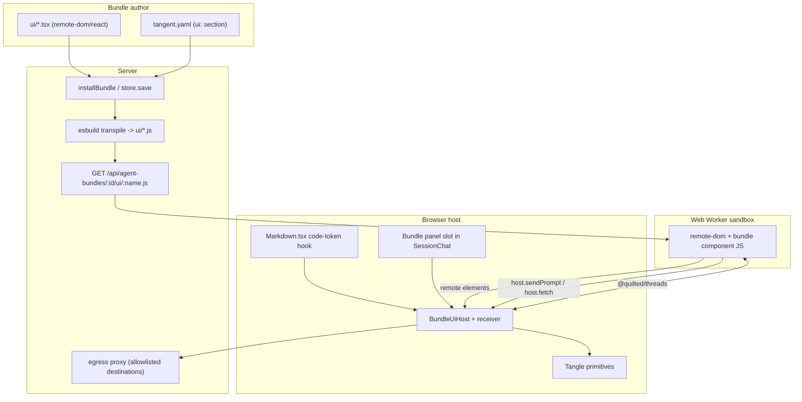

# Bundle UI Extensions

A **Configuration Bundle** can ship its own UI. Authors write `.tsx` components
that run **sandboxed in a Web Worker** (via [Shopify remote-dom][remote-dom]) and
render on the host with the existing Tangle UI primitives. Components never touch
the host DOM and can only reach data through an allowlisted **host bridge**.

This directory is the specification every later phase and every plugin author
builds against. For the underlying bundle format (manifest, directory layout,
how a bundle provisions a session), see
[`../config-bundle-format.md`](../config-bundle-format.md).

[remote-dom]: https://github.com/Shopify/remote-dom

## The two surfaces

A bundle's UI shows up in chat in exactly two ways:

- **Input panel** (`kind: panel`) — a proactive form or set of quick-buttons in
  the composer. The author composes a prompt from the user's input and sends it
  to Prime via `host.sendPrompt(text)`. Example: a "launch experiment" form.
- **Message component** (`kind: message`) — custom UI rendered from a special
  fenced code block the **agent** emits in its markdown output. The component
  receives JSON props from the token and may poll live data via
  `host.fetch(...)`. Example: a pipeline-progress chip that polls the real
  Tangle API.



## Documents

- [`architecture.md`](architecture.md) — host/worker split, data flow, why
  remote-dom, and where it plugs into the existing pipeline.
- [`manifest.md`](manifest.md) — the `ui:` manifest block and its validation
  rules.
- [`element-vocabulary.md`](element-vocabulary.md) — the allowlisted remote
  elements and how each maps to a Tangle primitive.
- [`host-bridge.md`](host-bridge.md) — the `getProps` / `sendPrompt` / `fetch`
  contract and the server-side egress allowlist.
- [`authoring-guide.md`](authoring-guide.md) — how to write a component and the
  agent output convention, with a worked example.
- [`rules.md`](rules.md) — the rules every plugin author MUST follow.
- [`security.md`](security.md) — threat model, sandbox guarantees, and the
  hardening roadmap.

## Glossary

- **Remote element** — a serializable element name (e.g. `tangent-button`) the
  worker emits. It has no implementation in the worker; it is a message the host
  turns into a real component. See [`element-vocabulary.md`](element-vocabulary.md).
- **Host primitive** — a real Tangle UI component in `src/shared/ui` (e.g.
  `Button`) that a remote element renders as on the host.
- **Host bridge** — the small, allowlisted API the host exposes to the worker:
  `getProps()`, `sendPrompt(text)`, `fetch(input, init?)`. The only channel a
  component has to the outside world. See [`host-bridge.md`](host-bridge.md).
- **Egress proxy** — the server-side proxy `host.fetch` routes through. It
  enforces an allowlist of permitted destinations and injects credentials, so
  the host (not the bundle) controls all network egress. See
  [`host-bridge.md`](host-bridge.md) and [`security.md`](security.md).
- **Worker sandbox** — the Web Worker the component executes in. It has no host
  DOM and (by policy) no direct network or app state. See
  [`security.md`](security.md).
- **Manifest `ui:` block** — the `ui.components[]` list in `tangent.yaml` that
  declares a bundle's components. See [`manifest.md`](manifest.md).
- **Agent output token** — the fenced ` ```tangent-ui:<name> ` code block, with a
  JSON body, that the agent emits to render a message component.
