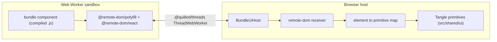
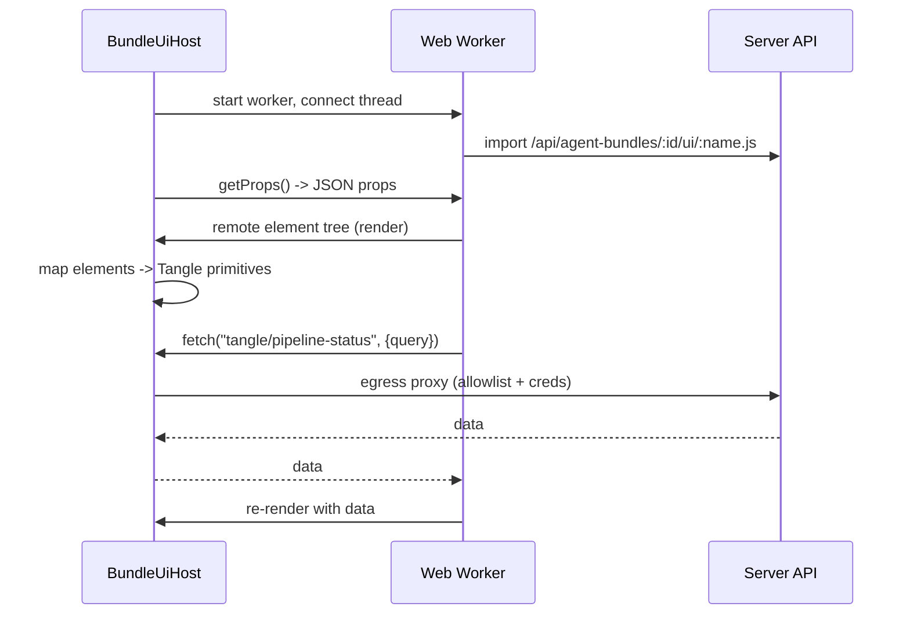

# Architecture

Bundle UI extensions let a bundle ship React components that run **sandboxed**
and render with the host's own design system. This document explains the
host/worker split, the data flow, why we use remote-dom, and exactly where the
feature plugs into the existing Tangent pipeline.

## Why remote-dom (not an iframe of arbitrary React, not `dangerouslySetInnerHTML`)

A bundle is third-party code. We want its UI to look native (use real Tangle
primitives, real theme, real spacing) while keeping it from:

- reaching the host DOM, app state, cookies, or storage,
- making arbitrary network calls,
- shipping its own divergent styling.

[Shopify remote-dom][remote-dom] solves exactly this. The component runs in a
**Web Worker** against a DOM polyfill. Instead of producing real DOM, it produces
a serialized tree of **remote elements** (e.g. `tangent-button`) that is streamed
to the host over a message channel. The host owns a fixed map from each remote
element to a real Tangle primitive and renders the tree itself. The component
therefore *cannot* render anything outside the allowlisted vocabulary, and every
side effect must go through an explicit, allowlisted bridge.

[remote-dom]: https://github.com/Shopify/remote-dom

## Host / worker split



- **Worker side** (`bundle-ui.worker.ts`, Phase 5): loads `@remote-dom/polyfill`
  and `@remote-dom/react`, dynamically imports the compiled component JS from
  `/api/agent-bundles/:id/ui/:name.js`, and renders it into a remote root.
- **Host side** (`BundleUiHost`, Phase 5): starts the worker, wires a
  `@quilted/threads` `ThreadWebWorker` for bidirectional calls, connects a
  remote-dom receiver, and renders incoming remote elements through the
  Phase-4 element-to-primitive map (see
  [`element-vocabulary.md`](element-vocabulary.md)).

The transport is deliberately a Web Worker first; an iframe + CSP variant is the
network-isolation upgrade path and is kept swappable (see
[`security.md`](security.md)).

## Data flow

### Message component (agent-driven)

1. The agent emits a fenced token in its markdown:
   ` ```tangent-ui:<name> ` with a JSON body of props.
2. The host markdown renderer detects the token, parses the JSON, and mounts a
   `BundleUiHost` for that component with those props.
3. The host serves the props to the worker via `host.getProps()`; the component
   renders and may poll live data with `host.fetch(input, init?)`.

### Input panel (user-driven)

1. The composer lists the bundle's `kind: panel` components and renders the
   selected one in a `BundleUiHost`.
2. The user fills the form; on submit the component calls
   `host.sendPrompt(text)`, which composes and sends a chat message to Prime.

## Where it plugs into the existing pipeline

This feature reuses existing seams rather than introducing a parallel pipeline.

### Compile + serve (server)

- Bundles are stored by [`server/src/store/fileAgentBundleStore.ts`](../../server/src/store/fileAgentBundleStore.ts),
  which implements the [`AgentBundleStore`](../../server/src/store/agentBundleStore.ts)
  interface. Its `save()` method already unzips, validates the manifest, and
  writes per-bundle files under `AGENT_BUNDLES_ROOT/<id>/`. **`save()` is the
  compile hook**: Phase 3 esbuild-transpiles each declared `ui.components[].entry`
  into `.agent-bundles/<id>/ui/<name>.js`.
- Routes live in [`server/src/routes/agentBundles.ts`](../../server/src/routes/agentBundles.ts).
  Phase 3 adds `GET /api/agent-bundles/:id/ui/:name.js` (served as
  `application/javascript`) plus a `store.readUiComponent(id, name)` method.

### Message rendering (host)

- Agent markdown is rendered by
  [`src/shared/lib/markdown/Markdown.tsx`](../../src/shared/lib/markdown/Markdown.tsx).
  Its `code` handler currently detects a language with `` /language-(\w+)/ ``.
  That regex matches only word characters, so it will **not** match a
  `tangent-ui:<name>` token (it contains a hyphen and a colon). Phase 6 widens
  this detection and, when a `tangent-ui:` token is found, renders a
  `BundleUiHost` instead of a `CodeBlock`.
- [`src/features/chat/components/ChatMessage.tsx`](../../src/features/chat/components/ChatMessage.tsx)
  renders agent content through `Markdown`. Phase 6 threads the session's
  `bundleId` down so the message component knows which bundle to load its JS from.

### Prompt sending (host)

- [`src/features/chat/hooks/useSessionChat.ts`](../../src/features/chat/hooks/useSessionChat.ts)
  exposes `send(content, attachments?)`, which emits the chat message over the
  session socket. `host.sendPrompt(text)` is wired to this `send()` (see
  [`host-bridge.md`](host-bridge.md)).

## Component lifecycle



## Phase map

| Phase | Concern | Key artifacts |
| --- | --- | --- |
| 1 | This spec | `docs/bundle-ui/*` |
| 2 | Manifest contract | `ui:` in `shared/configBundle.ts`, zod in `manifest.ts` |
| 3 | Compile + serve | esbuild in `save()`, `GET .../ui/:name.js` |
| 4 | Vocabulary + `tangent-progress` | shared element module + host map |
| 5 | Runtime + bridge | `bundle-ui.worker.ts`, `BundleUiHost`, `host.fetch` egress proxy |
| 6 | Chat integration | `Markdown.tsx` token hook, composer panel slot |
| 7 | Example PoC | extended Tangent ML bundle |
