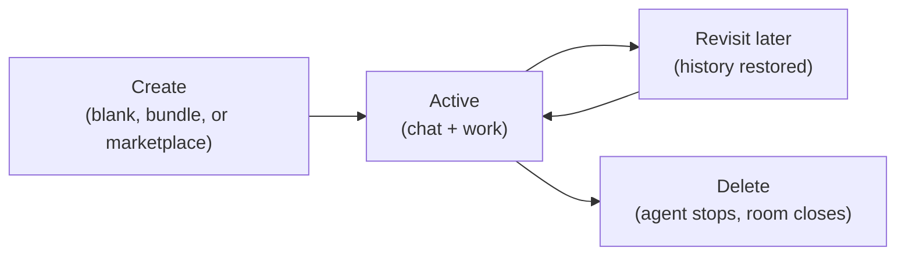
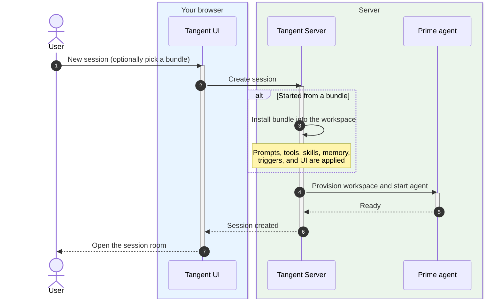
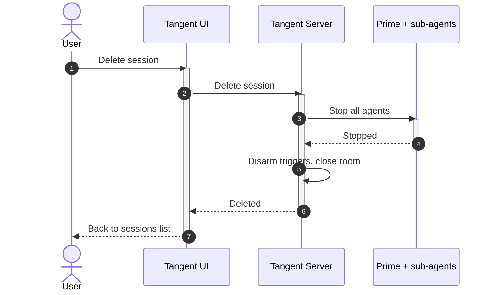

# Sessions

## The pitch

A **session** is your private workspace with an AI teammate. Open one and you get
a dedicated folder on disk, a full chat transcript, and an agent that's ready to
work — all isolated from every other session. Think of it as opening a fresh
project room: everything you do, every file the agent creates, and everything it
learns stays in that room until you come back.

## Why it's useful

- **Clean separation.** Each piece of work gets its own space — no cross-talk,
  no leaking files or context between projects.
- **Persistent.** The workspace, its files, and its results survive restarts.
  Close the tab and pick up exactly where you left off.
- **Instantly expert.** Start blank, or launch from an [Agent Bundle](03-agent-bundles.md)
  so the session arrives pre-loaded with the right prompts, tools, and skills.
- **One agent, real hands.** Every session comes with **Prime** — an agent that
  can read and write files, call tools, and coordinate helpers, not just chat.

## Tradeoffs to be honest about

- A session is **single-purpose by design**. For a different job, open a new one
  rather than overloading an existing room.
- Heavier than a one-off prompt: each session provisions a workspace and starts
  an agent process, so they're meant for real tasks, not throwaway questions.

## Lifecycle at a glance

## Creating a session

When you create a session, Tangent provisions a workspace and brings the agent
online before handing you the room. If you started from a bundle, the bundle's
preset is installed first so the agent wakes up already specialized.

## Deleting a session

Deleting a session is clean and complete: the agent (and any specialists it
spawned) is stopped, scheduled work is disarmed, and the room is closed.

## Where this shows up next

- Talk to the agent in [Session Chat](02-session-chat.md).
- Pre-load a session with an [Agent Bundle](03-agent-bundles.md).
