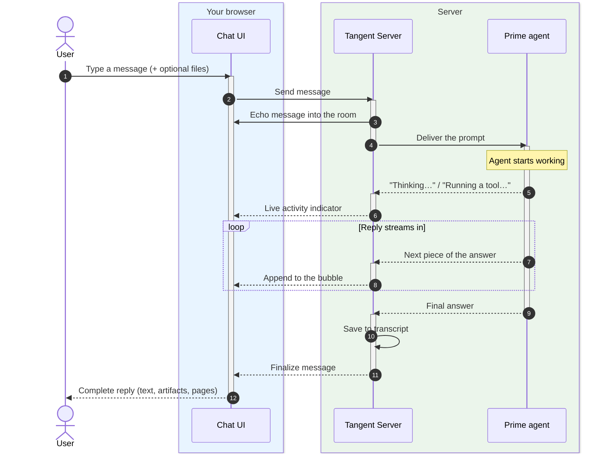
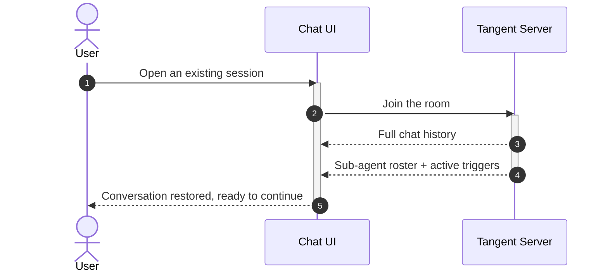

# Session Chat

## The pitch

Session Chat is the conversation at the heart of every session — but it's a
conversation with a teammate who actually works while you watch. You type (and
can attach files); the agent's reply **streams back live**, word by word, with a
visible sense of what it's doing: thinking, running a tool, or writing a file.

## Why it's useful

- **Live and transparent.** Replies stream as they're generated, and you see
  real-time activity ("Thinking…", "Running a tool…") so the agent never feels
  like a black box.
- **More than text.** Attach files to a message, and the agent can hand back
  real [Artifacts](06-artifacts.md) and embedded [Pages](07-pages.md) instead of
  walls of text.
- **A shared room.** The transcript is the single source of truth for the whole
  session — you, Prime, and any [sub-agents](05-subagent-orchestration.md) it
  spawns all appear in it, with specialists in their own threads.
- **Always resumable.** Rejoin a session and the full history is restored
  instantly.

## Tradeoffs to be honest about

- It's a **live connection**: the experience is best with the session open.
  Background, unattended work is what [Triggers](08-triggers.md) are for.
- The agent does real things (writes files, calls tools), so the chat is a
  workspace, not just a Q&A box — worth setting expectations for new users.

## Sending a message and getting a streamed reply

The user's message is saved and shown immediately, then handed to the agent. As
the agent works, Tangent streams its activity and its answer back into the room
in real time.

## Rejoining a session

## Where this shows up next

- See what the agent can build for you in [Artifacts](06-artifacts.md) and
  [Pages](07-pages.md).
- Watch the agent bring in helpers in
  [Sub-agent Orchestration](05-subagent-orchestration.md).
