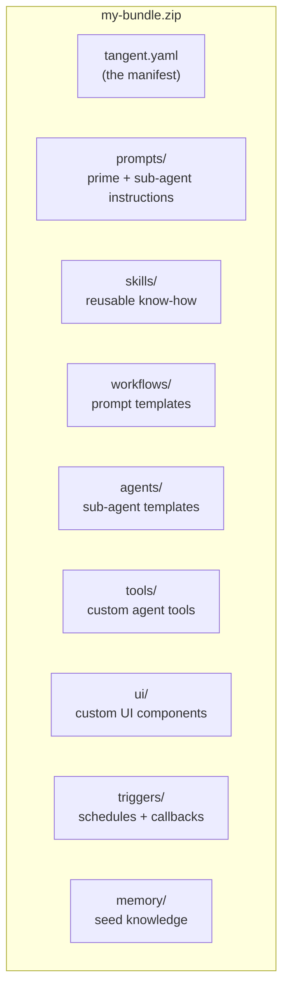
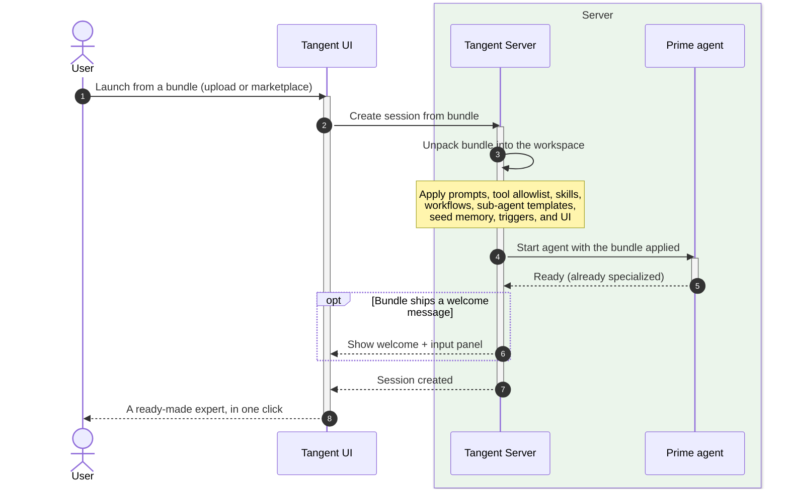

# Agent Bundles

## The pitch

An **Agent Bundle** is a single shareable file (`.zip`) that turns a plain chat
session into a ready-made expert. One bundle carries everything an agent needs
for a specific job — its instructions, the tools it's allowed to use, skills,
workflows, specialist sub-agent templates, seed memory, scheduled work, and even
custom UI. Install it, and the session wakes up already knowing how to do the
work.

Bundles are how you package expertise once and let anyone launch it in a click.

## Why it's useful

- **Instant specialization.** No prompt engineering on the spot — the bundle
  ships a tuned system prompt and a curated toolset.
- **Portable and shareable.** A bundle is just a file. Hand it to a teammate,
  publish it to a marketplace, version it like any other artifact.
- **Batteries included.** Skills, reusable workflows, sub-agent templates,
  starting memory, [triggers](08-triggers.md), and [custom UI](04-ui-extensions.md)
  all travel inside the same package.
- **Safe by default.** A bundle declares an explicit tool allowlist, so the
  agent can only use what the author approved.

## What's inside a bundle

Only the manifest (`tangent.yaml`) and a Prime prompt are strictly required;
everything else is optional and auto-discovered when present.

## A real example: the Tangle ML Pipeline Optimizer

The example bundle in `examples/configs/tangle-ml-pipeline-optimizer` is a
working expert. Its manifest declares who it is, the exact tools Prime may use
(including custom `tangle_*` tools that call a real ML platform), a set of
specialist sub-agents, and three custom UI components:

- A friendly **welcome message** that greets the user and drops an input panel
  to paste a pipeline URL.
- Custom **tools** (`tangle_run_submit`, `tangle_execution_state`, …) that let
  the agent drive the ML platform directly — see
  [Tools & Extensions](10-tools-and-extensions.md).
- Custom **UI** like a live pipeline-progress chip — see
  [UI Extensions](04-ui-extensions.md).
- A specialist **optimizer** sub-agent it can spawn to run experiments
  autonomously — see [Sub-agent Orchestration](05-subagent-orchestration.md).

The result: paste a URL, and a tuned expert analyzes the run, scores the
opportunity, and proposes prioritized experiments — with no setup from the user.

## Tradeoffs to be honest about

- A bundle is **opinionated**. It's tuned for its job; for a different job, use a
  different bundle (or none).
- Bundles can ship code (custom tools and UI). That's powerful, so authorship is
  a position of trust — Tangent contains it with tool allowlists, a network
  [egress allowlist](10-tools-and-extensions.md), and a UI sandbox
  ([UI Extensions](04-ui-extensions.md)).

## Installing a bundle into a session

When you start a session from a bundle, Tangent unpacks it into the workspace and
applies every piece before the agent comes online — so the very first message is
already coming from a specialist.

## Where this shows up next

- Custom UI a bundle can ship: [UI Extensions](04-ui-extensions.md).
- Custom tools a bundle can ship: [Tools & Extensions](10-tools-and-extensions.md).
- Specialists a bundle can define: [Sub-agent Orchestration](05-subagent-orchestration.md).
