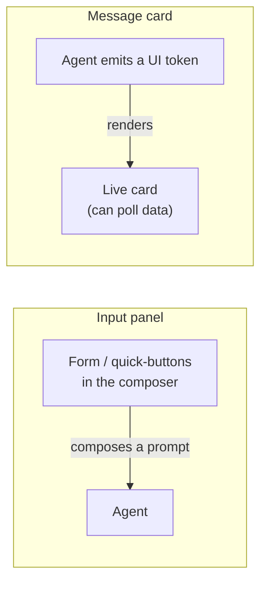
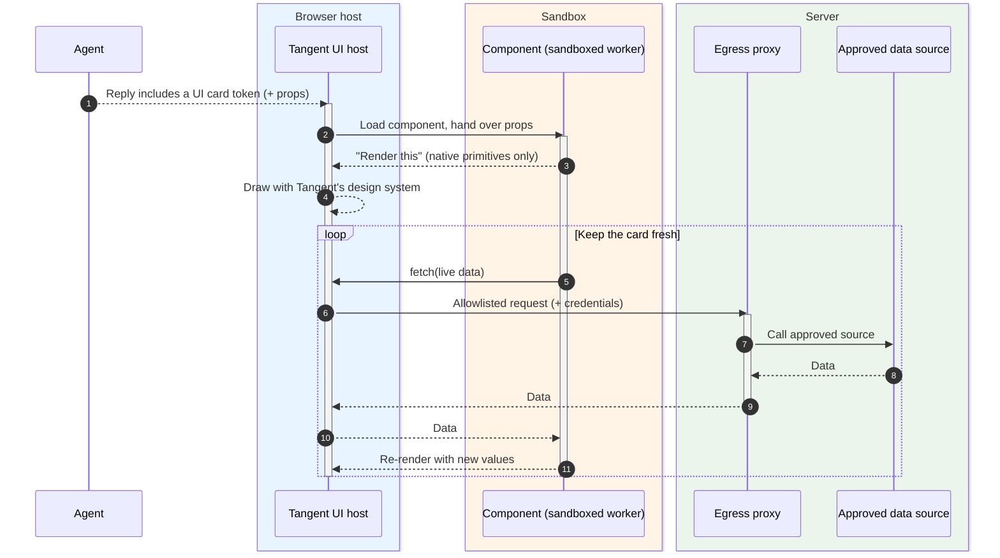
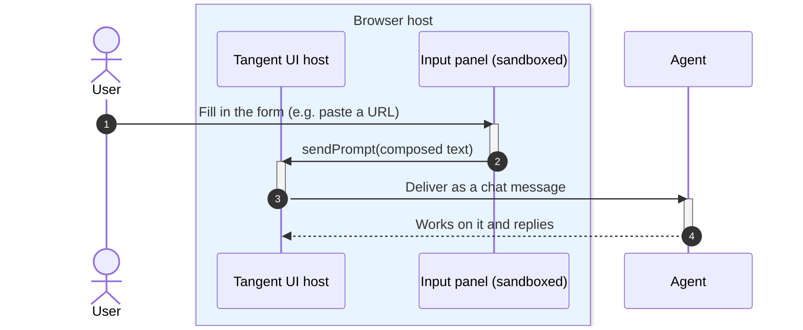

# UI Extensions

## The pitch

A bundle isn't limited to text — it can ship its **own UI**. Authors write small
React components that show up right inside the chat: input panels for the user
to fill in, and live message cards the agent can render in its replies. Best of
all, this third-party UI looks completely native (it uses Tangent's own design
system) and runs in a **sandbox**, so it can be rich and interactive without ever
touching your browser's data or making rogue network calls.

## Why it's useful

- **Native look, zero effort.** Components render with Tangent's real buttons,
  cards, and layout — they match the app automatically.
- **Two ways to appear:**
  - **Input panels** — a form or set of quick-buttons in the composer (e.g.
    "paste a pipeline URL" or "launch experiment"). The user fills it in and it
    sends a well-formed prompt to the agent.
  - **Message cards** — custom UI the **agent** renders inside its reply (e.g. a
    live progress bar) that can poll real data and update itself.
- **Live data, safely.** A message card can fetch fresh data through an
  allowlisted bridge — so a progress chip really does tick up as a job runs.
- **Safe by construction.** The component runs in a sandboxed worker with no
  access to the page, cookies, or arbitrary network. Its only outside channels
  are a tiny, explicit bridge.

## Tradeoffs to be honest about

- **A curated vocabulary.** Components can only use the allowlisted Tangent
  primitives — by design. Authors trade unlimited HTML for guaranteed-native,
  safe UI.
- **Network goes through the host.** A component can't call anywhere it likes;
  its data fetches are routed through the server's
  [egress allowlist](10-tools-and-extensions.md). Pre-approved sources only.

## Two surfaces

## How a live message card renders

The agent includes a small UI token in its reply. Tangent loads the bundle's
component into a **sandboxed worker**; the component describes what to show using
native primitives, and the host draws it. To stay fresh, the component can poll
live data — always through the host's allowlisted bridge, never directly.

## How an input panel works

## Where this shows up next

- The bundle that ships these components: [Agent Bundles](03-agent-bundles.md).
- How the allowlisted bridge and proxy keep it safe:
  [Tools & Extensions](10-tools-and-extensions.md).
