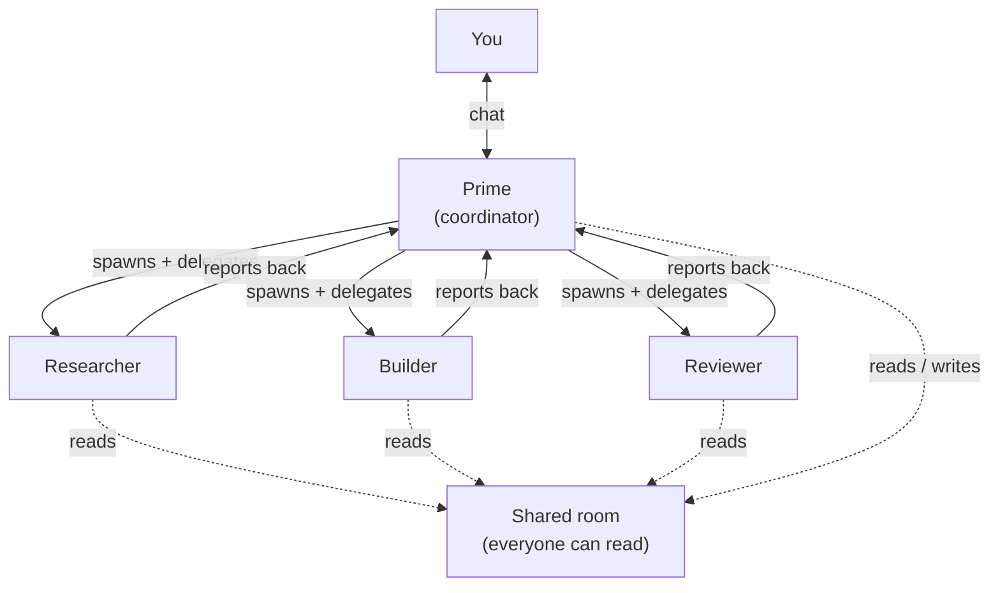
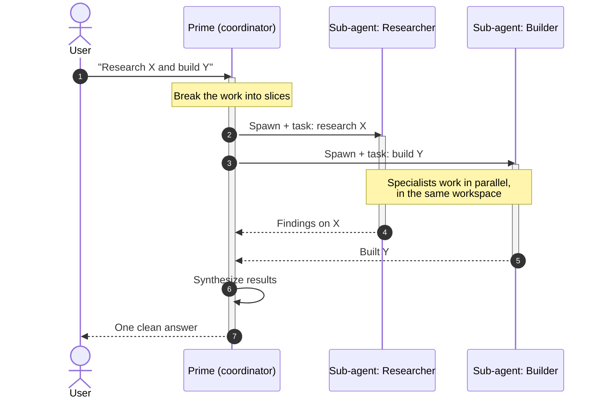
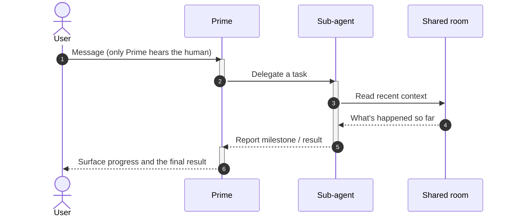

# Sub-agent Orchestration

## The pitch

Hard problems aren't solved by one mind doing everything in sequence — they're
solved by a coordinator delegating to specialists. Tangent works the same way.
Your session's main agent, **Prime**, can spin up **sub-agents** — focused
helpers with their own instructions and tools — that work **in parallel** in the
same shared workspace. Prime delegates, the specialists report back, and Prime
synthesizes one clean answer for you.

## Why it's useful

- **Parallelism.** Several specialists can work at once while Prime keeps
  coordinating — faster than one agent doing everything step by step.
- **Specialization.** A bundle can define focused roles (researcher, builder,
  reviewer, optimizer…). Each sub-agent gets only the context and tools it needs.
- **Cleaner thinking.** Narrow context per task beats one giant, sprawling
  conversation — specialists stay sharp and on-topic.
- **You still talk to one teammate.** Prime is the single face you converse
  with. The orchestration happens behind it, visible but not in your way.

## Tradeoffs to be honest about

- **More moving parts.** Each sub-agent is real work running in parallel, so
  complex tasks cost more than a single thread.
- **Prime is the only conductor.** Sub-agents don't command each other — they do
  their slice and report up. This keeps coordination simple and predictable, at
  the cost of fully peer-to-peer agent chatter.

## The shape of it

## A delegated task, end to end

You ask Prime for something big. Prime breaks it down, spins up specialists with
their tasks, lets them run in parallel, gathers their results, and gives you a
single synthesized answer. Each specialist also appears in its own thread, so you
can drill in if you want.

## The shared room

Every agent can read the session's shared transcript, so a specialist can catch
up on what's already happened before acting. The human only ever talks to Prime;
specialists do their slice and report up.

## Where this shows up next

- Specialists are defined by [Agent Bundles](03-agent-bundles.md) (the `agents/`
  templates).
- The tools each agent can use: [Tools & Extensions](10-tools-and-extensions.md).
