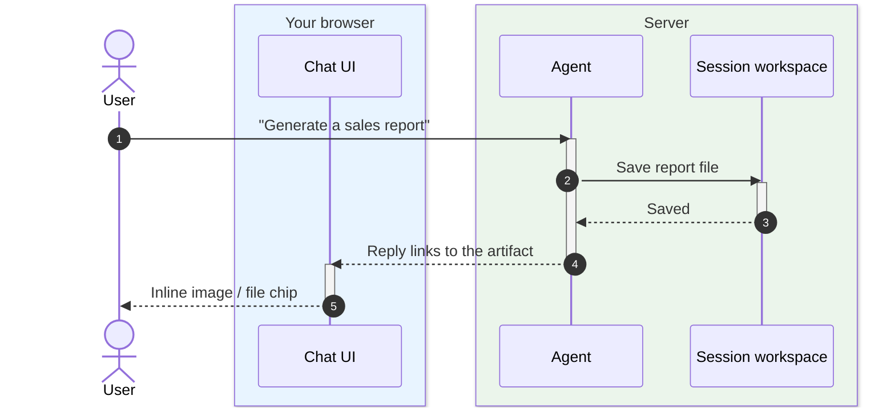
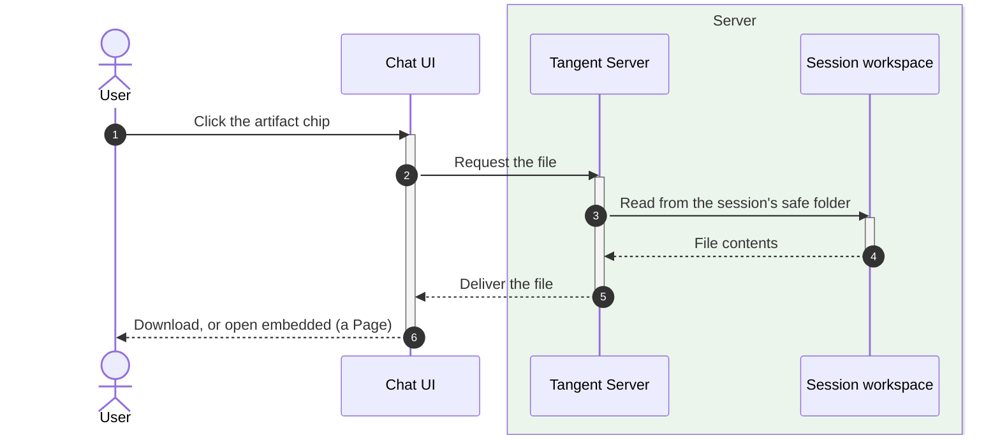

# Artifacts

## The pitch

When the agent produces something real — a report, a chart, a CSV, an image, a
data export — it doesn't dump it into the chat as a wall of text. It saves a real
**file** in the session and hands you a clean link. Images show inline, files
show as tidy chips you can open or download, and everything stays attached to the
session so you can come back to it later.

## Why it's useful

- **Keeps chat readable.** Big outputs live as files, not endless scrollback.
- **Real, usable formats.** Spreadsheets, images, PDFs, HTML reports — the
  actual deliverable, not a paraphrase of it.
- **Persistent.** Artifacts are saved with the session and survive restarts;
  reopen the room and they're still there.
- **First-class in chat.** Inline images render in place; other files become
  one-click chips. Rich, viewable files can even open **embedded** in the app —
  see [Pages](07-pages.md).

## Tradeoffs to be honest about

- **Session-scoped.** Artifacts live inside their session's workspace — they're
  not a public, shareable URL out of the box. That's a privacy feature, not a
  gap.
- **Served from a safe folder.** Only files the agent saves to the session's
  outputs (and your uploads) are exposed to the UI — the agent can't expose
  arbitrary parts of the machine.

## How an artifact gets created and shared

You ask for something; the agent does the work, **saves a file**, and links to it
in its reply. The UI turns that link into an inline image or a clickable chip.

## Opening or downloading an artifact

## Where this shows up next

- Rich, viewable artifacts open **inside** the app as
  [Pages](07-pages.md).
- The agent uses file-writing tools covered in
  [Tools & Extensions](10-tools-and-extensions.md).
