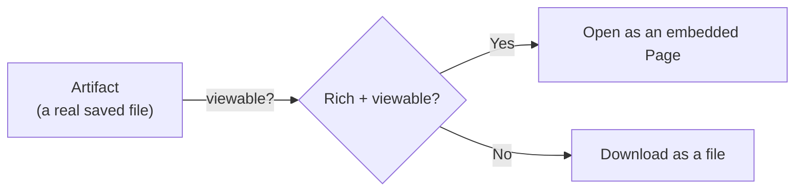
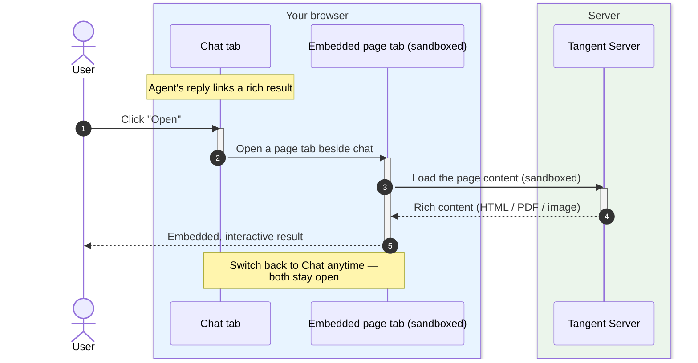

# Pages

## The pitch

**Pages** are rich, agent-built results you can open **right inside Tangent** —
no new tab, no download, no context switch. When the agent produces an
interactive HTML dashboard, a formatted report, a PDF, or a visualization, it
opens as a **page tab right beside the chat**. You read the result and keep
talking to the agent in the same view.

Pages are the "show, don't tell" surface: the agent doesn't describe the
dashboard, it hands you the dashboard — embedded.

## Why it's useful

- **Embedded, not exported.** The result lives inside the session UI as a tab
  next to Chat. You never leave Tangent to see what the agent made.
- **Stay in flow.** Flip between the conversation and the page instantly; ask a
  follow-up without losing the result.
- **Genuinely rich.** Interactive HTML, charts, PDFs, and images all render in
  place — far beyond what fits in a chat bubble.
- **Multiple at once.** Open several pages as tabs and switch between them like a
  mini browser built into the session.

## How Pages relate to Artifacts

A Page is the **embedded viewing experience** for a rich [Artifact](06-artifacts.md).
Every Page is backed by a real file the agent saved; "Page" is simply what we
call it when that file is something you can open and explore inside the app
rather than just download.

## Tradeoffs to be honest about

- **Sandboxed for safety.** Embedded pages run isolated, so agent-authored
  content can be interactive without reaching your app's data or credentials.
  That isolation is deliberate.
- **Best for viewable formats.** Rich, viewable files become Pages; other files
  remain clean download chips. The right surface for the right output.

## Opening a Page

The agent saves a rich result and links it. Because the file is viewable, the
link becomes an **Open** action — and clicking it pops a page tab beside the chat,
rendered safely in an embedded, sandboxed view.

## Where this shows up next

- The files behind Pages: [Artifacts](06-artifacts.md).
- Bundles can also ship interactive in-chat cards via
  [UI Extensions](04-ui-extensions.md).
