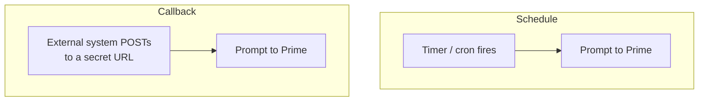
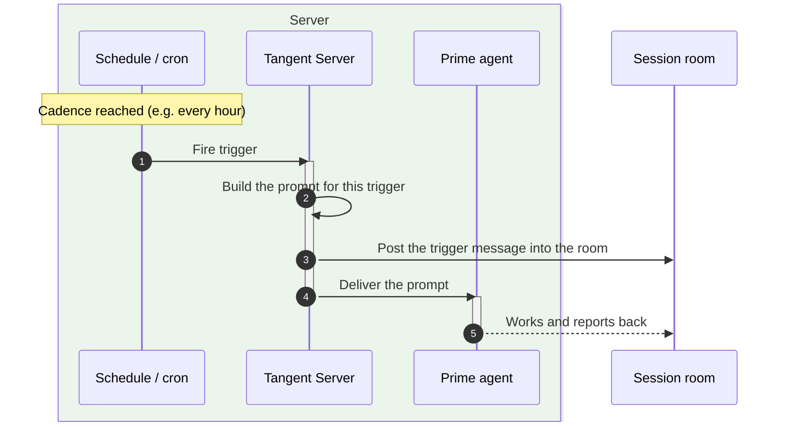
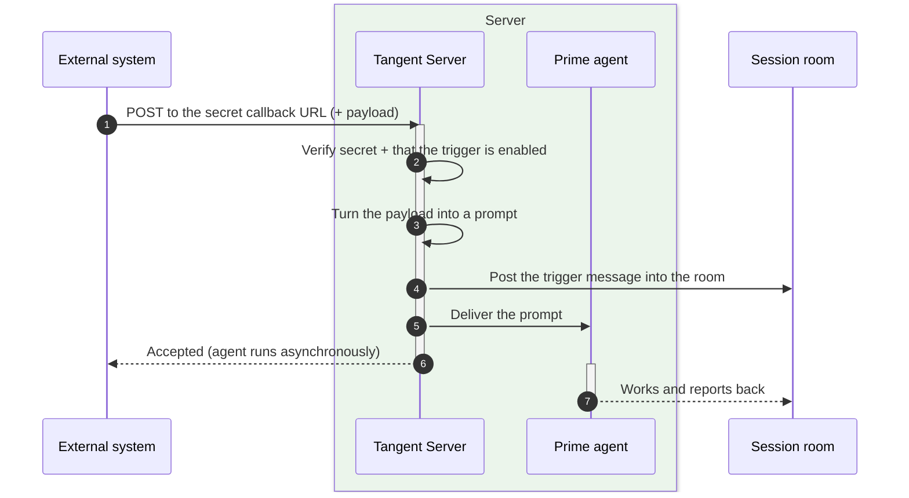
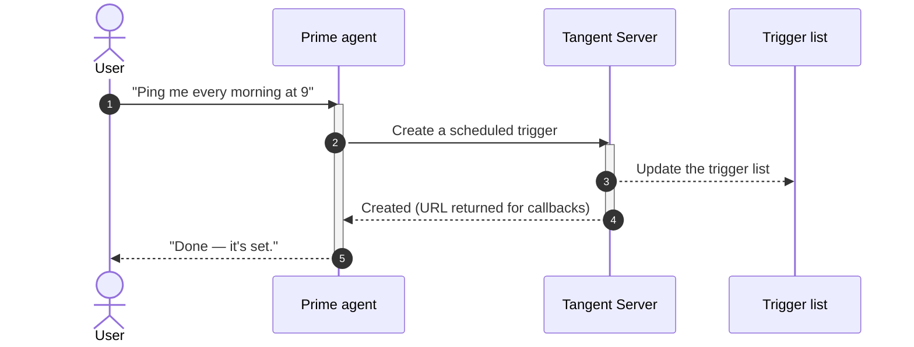

# Triggers

## The pitch

Your agent shouldn't only work when you're typing. **Triggers** let a session
wake up on its own and act — either on a **schedule** (every hour, every morning,
on a cron) or when an **external system calls it** (a webhook from CI, an
incident tool, a form). A trigger turns an outside signal into a prompt delivered
straight to Prime, exactly as if you'd typed it — so the agent can monitor,
react, and report without you in the loop.

## Why it's useful

- **Always-on automation.** "Check the dashboards every hour and ping me if
  something's off" — set it once, and the session keeps doing it.
- **Event-driven reactions.** Wire a webhook so a deploy failure, a new ticket,
  or a form submission instantly puts the agent to work.
- **Travels in the bundle.** A [bundle](03-agent-bundles.md) can ship ready-made
  triggers, so an expert arrives already automated.
- **Conversational control.** You can just ask Prime to "remind me every
  morning" and it sets up the trigger for you — no config screen required.

## Two kinds

| | **Schedule** | **Callback** |
| --- | --- | --- |
| Wakes on | A timer or cron (e.g. every `1h`, or `0 9 * * *`) | An external system calling a private URL |
| Best for | Periodic checks, digests, reminders | Webhooks, integrations, event reactions |
| You provide | A cadence + what to do | A handler/template; share the secret URL |

## Tradeoffs to be honest about

- **The server has to be running** for schedules to fire (they re-arm
  automatically when the session reconnects).
- **A callback URL carries a secret.** Anyone with the link can fire that
  trigger, so treat it like a credential. Disabled triggers simply refuse to
  fire.
- **Automation needs guardrails.** A trigger gives the agent initiative — pair
  it with a clear prompt so it does exactly the intended thing.

## A scheduled trigger firing

On its cadence, Tangent composes the trigger's prompt and delivers it to Prime
just like a user message — so the result lands right in the session transcript.

## A callback trigger firing

## Managing triggers in conversation

You don't need a settings page — Prime can create, enable, disable, and delete
triggers when you ask. For a callback, it hands you back the private URL to give
to your external system.

## Where this shows up next

- Bundles ship triggers by default: [Agent Bundles](03-agent-bundles.md).
- What the woken agent can actually do: [Tools & Extensions](10-tools-and-extensions.md).
