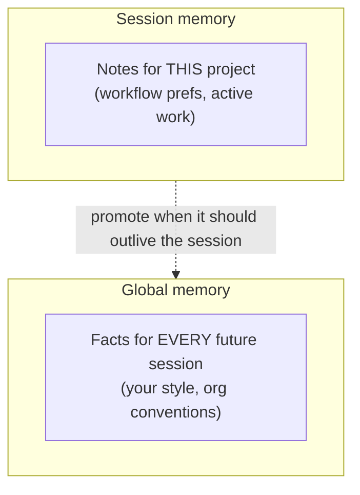
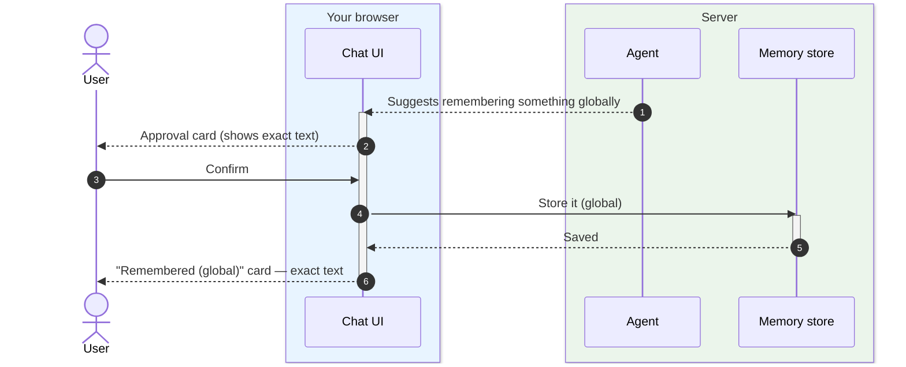
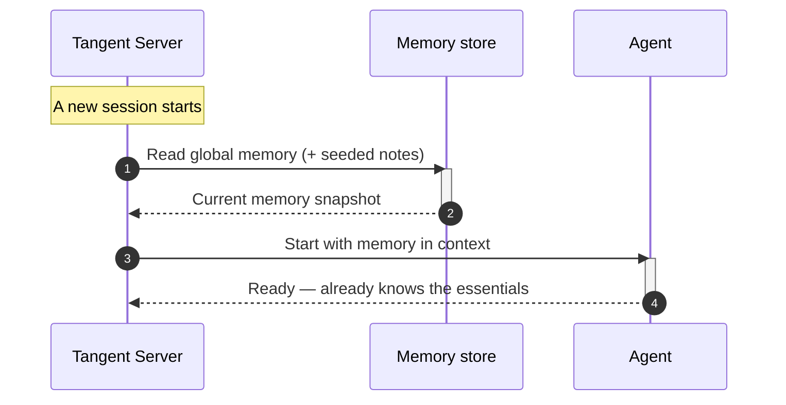

# Agent Memory

## The pitch

A good teammate remembers things — your preferences, the conventions, the
context — so you don't repeat yourself. Tangent gives the agent **memory**, split
into two clear scopes: **session memory** (what matters for this one project) and
**global memory** (what should carry across every future session). And because
trust matters, the agent can't quietly "learn" things about you: anything it
wants to remember globally is shown to you for **approval**, with the exact text
it will store.

## Why it's useful

- **No more repeating yourself.** Preferences and context persist, so the agent
  stays consistent over time.
- **Two scopes, the right reach.** Session memory keeps project-specific notes
  local; global memory shares durable facts (your style, org conventions) with
  every new session.
- **You see ground truth.** When something is remembered, you get a highlighted
  "Remembered" card showing exactly what was stored — not the agent's claim about
  it.
- **Compounding value.** Global memory means each session starts a little
  smarter than the last.

## Two scopes

## Tradeoffs to be honest about

- **Session memory is local and ephemeral-by-scope.** Great for low-friction
  notes, but it stays with that session unless promoted to global.
- **Global memory is gated on purpose.** The agent can write session notes
  freely, but agent-initiated **global** memory always passes through your
  confirm/dismiss approval — nothing shared-across-sessions is stored without
  your say-so.

## Approving a global memory

When the agent thinks something is worth remembering for the long term, it
**proposes** it. You see a card with the exact text and choose to keep or dismiss
it. Only on your confirmation is it stored — and then a "Remembered" card shows
what was saved.

> If you simply tell the agent to "remember this," it's stored directly and you
> still get the confirming "Remembered" card. The approval step is specifically
> for memory the **agent** proposes on its own.

## Memory in every new session

When a session starts, the agent is given the current memory up front — so it
arrives already aware of your global facts and any seeded notes from the
[bundle](03-agent-bundles.md).

## Where this shows up next

- Bundles can seed starting memory: [Agent Bundles](03-agent-bundles.md).
- Memory shows up in the live conversation: [Session Chat](02-session-chat.md).
