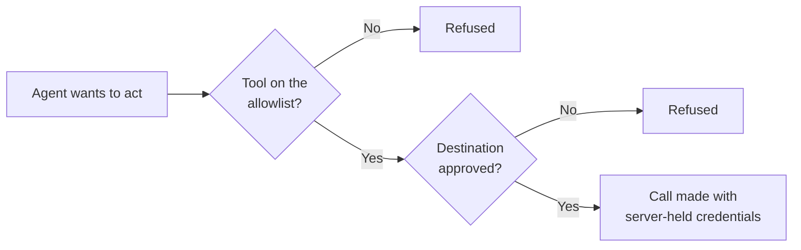
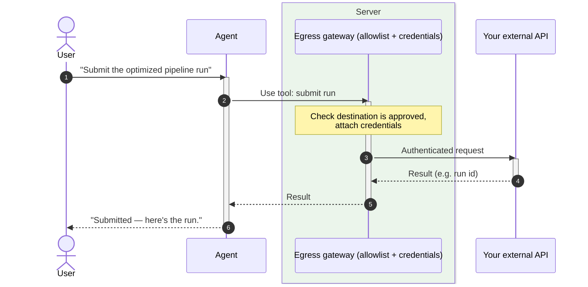
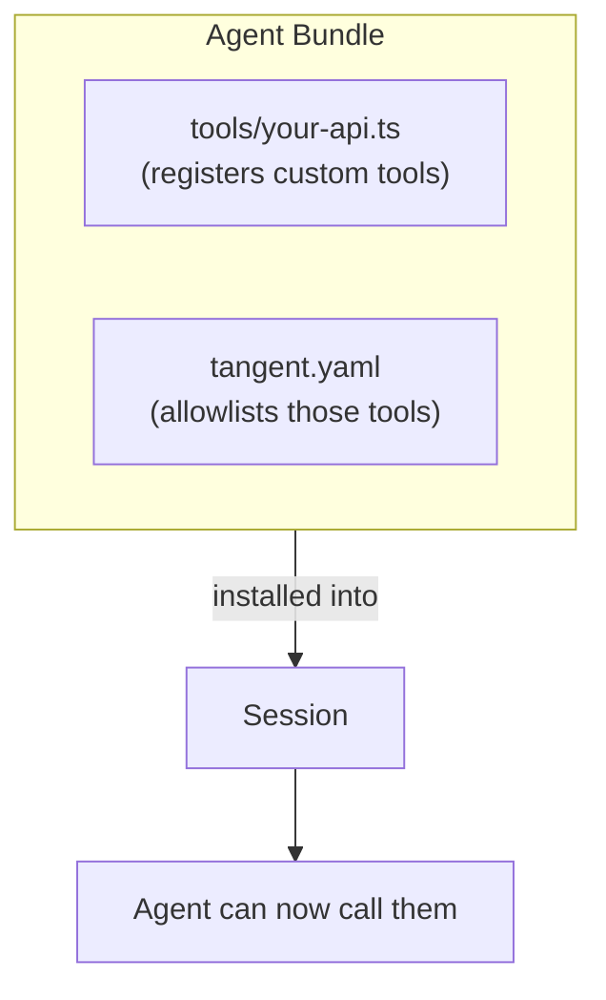

# Tools & Extensions

## The pitch

Out of the box, the agent can read and write files and run commands in its
workspace. **Extensions** take it further: a [bundle](03-agent-bundles.md) can
ship **custom tools** that connect the agent to your systems — your ML platform,
your internal APIs, your services — so it can actually _do_ things, not just talk
about them. And it does this safely: every tool is on an explicit allowlist, and
every outbound call is routed through a server-side gateway that holds the
credentials and only permits pre-approved destinations.

## Why it's useful

- **Real capabilities.** The example bundle adds tools like `tangle_run_submit`
  and `tangle_execution_state`, so the agent can launch and monitor real ML
  pipeline runs from chat.
- **Extend without forking.** Bundle authors add new powers by shipping a small
  tool file — no changes to Tangent itself.
- **Two layers of safety:**
  - **Tool allowlist** — the agent can only call tools the bundle explicitly
    permits.
  - **Egress gateway** — even an allowed tool can only reach **approved**
    destinations, and the agent never holds your API keys; the server injects
    them.
- **Built-ins included.** Orchestration ([sub-agents](05-subagent-orchestration.md)),
  [memory](09-agent-memory.md), and [triggers](08-triggers.md) are themselves
  extensions every session gets.

## Tradeoffs to be honest about

- **Allowlists are strict by design.** If a tool isn't listed, the agent can't
  use it; if a destination isn't approved, the call is refused. That's the
  safety guarantee — it just means new integrations are a deliberate choice.
- **Custom tools are author-trusted code.** Powerful, so Tangent contains them:
  no direct network, credentials held server-side, approved endpoints only.

## The two safety layers

## A bundle tool in action

The agent calls a bundle-provided tool (say, "submit this pipeline run"). The
request goes through Tangent's egress gateway, which checks the destination
against the allowlist, adds the right credentials, and makes the call. The result
comes back into the conversation.

## How a bundle adds tools

## Where this shows up next

- The package that ships tools: [Agent Bundles](03-agent-bundles.md).
- The same gateway powers safe data fetches for
  [UI Extensions](04-ui-extensions.md).
- Built-in extensions: [Orchestration](05-subagent-orchestration.md),
  [Memory](09-agent-memory.md), [Triggers](08-triggers.md).
