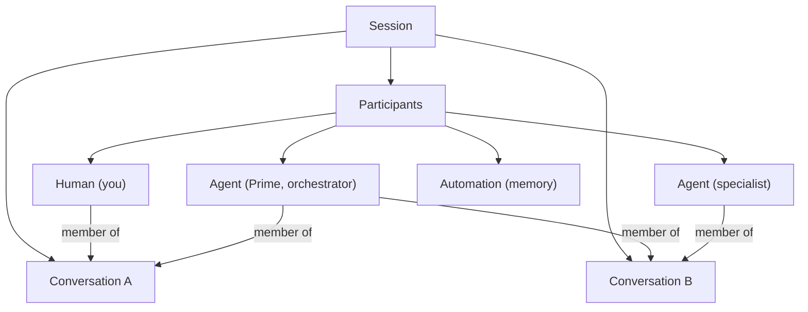

# Conversations & Participants

## The pitch

A session used to be one human and one agent in a single thread. Now a session
is a small **room of participants** talking across one or more **conversations**.
A conversation is a transcript plus the set of members attached to it; a
participant is anyone in the session — a person, an agent, or an automation. This
is what lets a session grow from "me and my agent" into "me, a teammate, a
coordinator, and two specialists" without changing how chat feels.

## The two ideas

- **Conversation.** A transcript and its membership. It is the unit of "who can
  see this and who reacts to it." A conversation is _not_ tied to a single agent:
  several participants can share one, and one participant can be in several.
- **Participant.** A session-scoped identity with a kind:
  - **Human** — a person in the session.
  - **Agent** — Prime, a spawned specialist, or an outside agent reached over a
    protocol. Placement (local, remote, external) is not part of the kind.
  - **Automation** — a non-conversational actor that contributes messages, such
    as the memory system posting a "Remembered" note.

## Why it's useful

- **Real multi-party work.** More than one person and more than one agent can
  share a thread, so a session can be a small team rather than a 1:1 chat.
- **Attribution you can trust.** Every message names its author by a stable id,
  not a display name — renaming someone never rewrites history or breaks a past
  `@mention`.
- **Control without new concepts.** Muting a member is just its reaction rule set
  to "never." Moderation and focus fall out of the same primitive that decides
  who wakes.

## Membership: who reacts to what

Being in a conversation carries a **reaction rule** — what wakes a participant
when a message lands:

- **always** — react to every message (an observer, or a coordinator watching a
  thread).
- **fromHumans** — react only to human turns.
- **mentionsMe** — react only when explicitly `@mentioned` (a specialist on call).
- **atRunEnd** — react when another participant finishes a turn.
- **never** — never react (a muted member, or a compliance participant that only
  contributes and never runs).

Because reaction is configuration on the membership, the server decides delivery
centrally. Addressing a room does not force every agent to run — each member's
rule decides.

## No privileged thread

There is no hardcoded "main" conversation. The agent that plays coordinator holds
an **orchestrator** capability, and the UI presents its thread as primary because
of that capability — not because of a reserved name. Any agent could, in
principle, be the coordinator; the session simply designates one.

## Presence

Humans have **presence** — connected, away, or detached — so you can see who is
actually around. Presence follows the person across the session, independent of
which conversation is open.

## Where this shows up next

- Chat itself: [Session Chat](02-session-chat.md).
- Coordinators and specialists: [Sub-agent Orchestration](05-subagent-orchestration.md).
- The workspace that holds it all: [Sessions](01-sessions.md).
