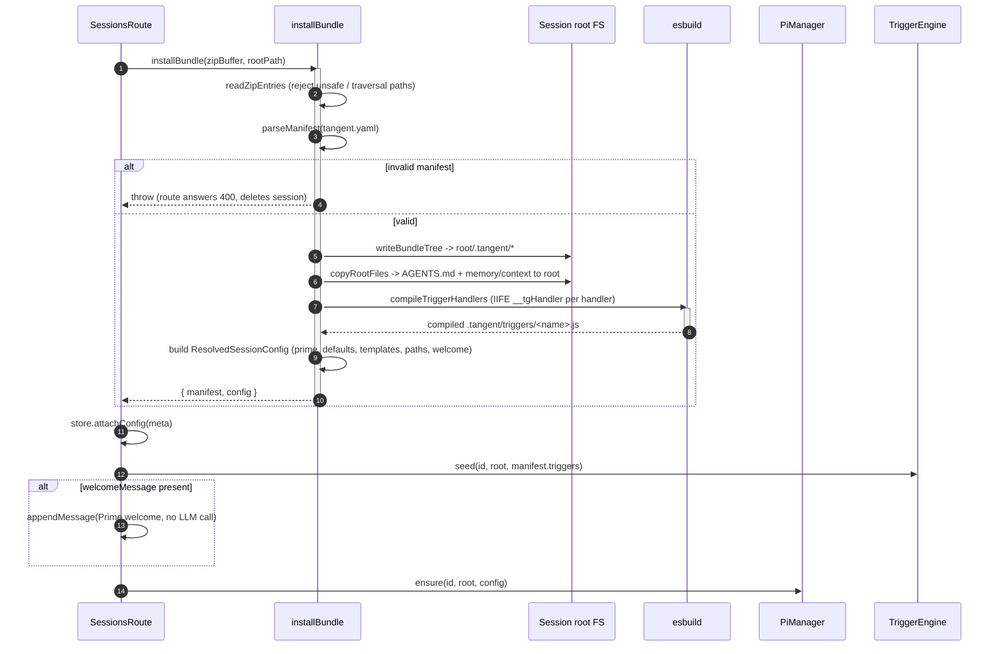

# Configuration Bundles

[< Back to index](./index.md)

A **Configuration Bundle** is a portable `*.zip` that fully provisions a
session: Prime + sub-agent prompts, tool allowlists, skills, workflows, agent
templates, rules, seed memory, custom tool extensions, sandboxed UI components,
and triggers. The format is defined once in
[shared/configBundle.ts](../../shared/configBundle.ts) so the browser builder and
the server validator never drift.

This doc covers the manifest schema + validation, the conventional layout, the
install pipeline, and the marketplace store. For how the installed config feeds
the spawn, see [extensions-and-prompts.md](./extensions-and-prompts.md).

---

## Manifest + layout

The required manifest is `tangent.yaml` at the bundle root (`MANIFEST_FILENAME`),
schema-versioned by `SCHEMA_VERSION` (currently `1`). Conventional directories
(`BUNDLE_DIRS`):

| Dir                      | Contents                                   | Pi flag / use                                |
| ------------------------ | ------------------------------------------ | -------------------------------------------- |
| `prompts/`               | `prime.md`, `subagent.md` appended prompts | `--append-system-prompt` source              |
| `skills/<name>/SKILL.md` | skills                                     | `--skill <dir>`                              |
| `workflows/<name>.md`    | prompt templates                           | `--prompt-template <file>`                   |
| `agents/<name>.md`       | sub-agent templates (frontmatter + body)   | resolved into `templates`                    |
| `rules/AGENTS.md`        | rules file                                 | copied to workspace root (Pi auto-discovers) |
| `memory/*.md`            | seed memory                                | copied to workspace root                     |
| `tools/*.ts`             | custom tool extensions                     | extra `--extension <file>`                   |
| `ui/<name>.tsx`          | sandboxed UI components                    | transpiled, served by marketplace            |
| `triggers/<name>.ts`     | trigger transform handlers                 | compiled to JS at install                    |

The `BundleManifest` (validated to a `zod` schema in
[config/manifest.ts](../../server/src/pi/config/manifest.ts)) carries: `id`
(slug), `name`, `version`, optional `description`/`author`/`icon`/`tags`, a
`prime` block (`systemPrompt`, optional `tools`, optional `welcomeMessage`),
optional `subagents` defaults, the optional explicit list fields (`skills`,
`workflows`, `agents`, `contextFiles`, `memory`, `extensions`), optional
`software` requirements, optional `ui.components`, and optional `triggers`.

### Validation

`parseManifest(yamlText)` parses YAML then runs `manifestSchema.safeParse`,
collecting **every** issue (not failing on the first) so an author fixes a
malformed `tangent.yaml` in one pass. Errors are returned as a flat list of
`tangent.yaml: "<path>" <message>`. Key rules:

- `schemaVersion` must equal the literal `SCHEMA_VERSION`.
- `id`, UI component `name`, and trigger `name` must match `^[a-z0-9][a-z0-9-]*$`.
- Every referenced path goes through `safePath` (non-empty, relative POSIX, no
  `..`, no absolute/drive prefix).
- A trigger must define `prompt` or `handler`; a `schedule` trigger needs
  `schedule.every` or `schedule.cron`. Duplicate trigger/component names are
  rejected.

A compile-time guard (`_schemaMatchesContract`) keeps the schema output
assignable to the shared `BundleManifest` type.

---

## Install pipeline (`installBundle`)

[config/bundleLoader.ts](../../server/src/pi/config/bundleLoader.ts) installs a
bundle into a session root and returns `{ manifest, config }`.

Steps in detail:

1. **`readZipEntries`** unzips with `fflate` and rejects directory entries and
   any unsafe entry path (`isSafeEntryPath` mirrors the manifest guard) so a
   malicious archive can't write outside the session root.
2. **`writeBundleTree`** mirrors the whole bundle under `<root>/.tangent/`.
3. **`copyRootFiles`** copies `rules/AGENTS.md` to the root as `AGENTS.md`, and
   flattens `memory/*.md` + declared `contextFiles` to their basenames at the
   root, where Pi auto-discovers them from `cwd`.
4. **`compileTriggerHandlers`** transpiles each declared trigger handler to a
   self-contained IIFE (`globalName: "__tgHandler"`) under
   `.tangent/triggers/<name>.js`. A missing/uncompilable handler fails the
   install rather than failing at fire time.
5. **`ResolvedSessionConfig`** is assembled: `prime` (tools via
   `resolvePrimeTools` — the manifest tools unioned with the shared and Prime-only
   groups, including the trigger tools, so a bundle never re-declares them; prompt
   via `composePrimePrompt`, which prepends the always-on `primeSystemPrompt.md` manual
   to the manifest's prompt), `subagentDefaults`, `templates` (parsed from
   `.tangent/agents`), the absolute skill/workflow/extension paths
   (`resolveSectionPaths`), and the optional `welcomeMessage`.

`listOrDiscover` means an omitted manifest list (e.g. no `skills:`) triggers
auto-discovery of the conventional directory; when present, the manifest list is
authoritative.

---

## Two entry points into install

Both create-session paths share `createSessionFromBundle`
([routes/sessions.ts](../../server/src/routes/sessions.ts)):

- **Uploaded ZIP** — `POST /api/sessions` with a multipart `config` file
  (`bundleUpload.single("config")`). The buffer is the bundle.
- **Marketplace bundle** — `POST /api/sessions` with `{ bundleId }`. The server
  reads the stored ZIP via `agentBundleStore.readBundle(bundleId)`; a missing id
  answers `404` before any session is created.

On any install error the just-created session is deleted so a failed upload
leaves nothing half-provisioned.

---

## The marketplace store

[store/fileAgentBundleStore.ts](../../server/src/store/fileAgentBundleStore.ts)
is a filesystem-backed store under `AGENT_BUNDLES_ROOT/<id>/` holding
`bundle.zip`, an extracted `manifest.json` (the `AgentBundleMeta` used for fast
listing), an optional `icon.svg`, and compiled UI component JS under `ui/`.

`save(zipBuffer)`:

1. `parseBundle` unzips, requires + validates `tangent.yaml`, and guards the
   `id` (it becomes a directory name).
2. Rejects an exact `id`+`version` collision with `AgentBundleConflictError`
   (409).
3. Wipes any prior version's directory wholesale (so a stale icon or compiled UI
   asset can't linger), writes the ZIP, **compiles UI components before**
   persisting metadata (a bad UI source fails the upload), then writes
   `manifest.json` and the icon.

`compileUiComponents` extracts the bundle to a temp dir so esbuild can resolve
relative sibling imports, then transpiles each declared `ui.components[].entry`
to ESM via the shared `buildUiComponent` helper from `@tangent/ui-extensions-sdk`
(the same helper the `ui-extensions` authoring CLI uses, so local builds match).
Bare imports like `react` and `@tangent/ui-extensions-sdk` are left for the
worker import map; the component never executes at upload. Output lands at
`ui/<name>.js`.

The marketplace routes ([routes/agentBundles.ts](../../server/src/routes/agentBundles.ts))
expose list / get / icon / download / `ui/:file` / upload / delete, plus the
`ui-egress` proxy (see [egress-and-security.md](./egress-and-security.md)).
