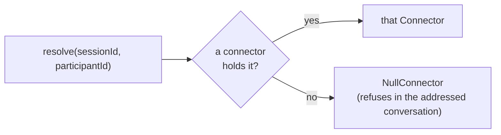

# Connectors

[< Back to index](./index.md)

A **connector** is how a participant is reached: a transport plus the roster of
participants it currently holds. The [ConnectorRegistry](../../apps/server/src/connectors/connectorRegistry.ts)
resolves any participant to exactly one connector, so every caller — a human turn,
`message_subagent`, a kill, a revive — routes through the same lookup instead of
re-deriving the transport from a host label. This is the convergence of what used
to be three parallel gateways.

The code lives under [apps/server/src/connectors/](../../apps/server/src/connectors).

---

## Total resolution

`ConnectorRegistry.resolve(sessionId, participantId)` is **total**: every
participant id resolves to a connector. An id no connector holds resolves to the
[NullConnector](../../apps/server/src/connectors/nullConnector.ts), which refuses
delivery *in the conversation it was addressed to* rather than falling through to
whichever transport happens to be checked last. There is no branch in which a
message aimed at one participant is silently mis-delivered to another.

The `Connector` interface ([types.ts](../../apps/server/src/connectors/types.ts))
makes capability explicit rather than implicit:

- `deliver` is required of every connector. One that cannot accept a message
  declares `acceptsDelivery = false` and refuses — an absent method is a
  compile-time refusal, while an untaken branch is a runtime mis-delivery.
- `cancelRun` and `revive` follow the same rule: a transport with no cancel
  protocol, or no way to bring a participant back, says so by declaration.
- `credential` follows it too — a new connector does not compile until it states
  how its far end proves who it is.

---

## Connector facets

`host` (`local` / `remote` / `external`) is gone as the axis that distinguishes
connectors; it survives only as a deprecated derived label. In its place a
[ConnectorDescriptor](../../packages/shared/src/contracts.ts) carries independent
facets, so a fourth connector does not need a fourth special case:

- **kind** — `pi-stdio` | `remote-env` | `external-inbound` | `a2a` (plus
  `unresolved` for the null fallback).
- **lifecycle** — `owned` (Tangent created it and destroys it) vs `attached`
  (Tangent joined one that outlives the attachment).
- **spawnAuthority** — `server` | `remote-env` | `bundle-tool` | `none`; who may
  create a participant on this connector.
- **credentialScheme** — how the far end authenticates (the secret itself stays
  server-side, never on the descriptor, because the descriptor goes to clients).
- **environmentId / endpointUrl** — the remote environment a participant is bound
  to, or the outbound address Tangent dials.

The facet table each kind runs with is `CONNECTOR_FACETS`, and default transcript
visibility per kind is `DEFAULT_TRANSCRIPT_VISIBILITY` (a far end outside Tangent
defaults to `opaque`).

---

## The four connectors

| Kind               | Implementation                                                                              | Lifecycle | Spawn authority | Runs where                                       |
| ------------------ | ------------------------------------------------------------------------------------------- | --------- | --------------- | ------------------------------------------------ |
| `pi-stdio`         | [PiConnector](../../apps/server/src/connectors/piConnector.ts) → `PiAgentManager`           | owned     | `server`        | a local `pi --mode rpc` child process            |
| `remote-env`       | [RemoteEnvConnector](../../apps/server/src/connectors/remoteEnvConnector.ts) → gateway      | owned     | `remote-env`    | a connected remote environment (`/remote-env`)   |
| `external-inbound` | [ExternalConnector](../../apps/server/src/connectors/externalConnector.ts) → gateway        | owned     | `bundle-tool`   | outside Tangent, streamed in by a bundle tool    |
| `a2a`              | [A2aConnector](../../apps/server/src/connectors/a2aConnector.ts) → `A2aPeerGateway`         | attached  | `none`          | an independently deployed agent, dialed over A2A |

Each is a thin adapter over the gateway that already existed; the registry is what
unifies them. `list` walks every connector's roster; `revive` restores a persisted
sub-agent through the connector its recorded kind names (resolution can't be used
during a revive because nothing holds the participant yet); `spawner(kind)` narrows
to a connector the spawn API may create on (`server` / `remote-env` only —
`bundle-tool` and `none` participants exist because something else created them).

---

## Runs

A [Run](../../apps/server/src/runs/runRegistry.ts) is one unit of work by one
participant: what a stream of `agent:*` events is attributable to, and what
cancellation acts on. Runs are serial per participant — opening one settles
whichever Run that participant still had open. A Run records its `homeConversationId`
(where its Messages land by default), its `ingress` (`reaction` | `schedule` |
`webhook` | `tool`), and, for a connector whose far end has its own task identity,
an `externalId` and a resume `cursor`. On startup the `RunRegistry` settles any
run left `running` by a previous process — nothing can be running before the server
starts.

Cancellation is a connector capability: `AgentAbort` resolves a run id and the
registry cancels it through whichever connector holds the participant, rather than
a caller deciding by inspecting the transport.

---

## A2A: point-to-point vs a shared room

An A2A peer is an ordinary `agent` participant whose connector speaks A2A — not a
distinct participant kind. It can be reached two ways:

- **Point-to-point.** A directed exchange whose reply routes back to the peer's own
  home Conversation.
- **In a shared room.** When attached with `share_in_room`, the peer joins the
  orchestrator's Conversation as a member and its per-turn reply routes into
  whichever Conversation addressed it. It participates as an **opaque** member: it
  receives the Message that addresses it rather than subscribing to the whole log.

The same mechanism (memberships + reaction predicates + connectors) covers an
observer agent following a whole transcript (`always`), a compliance participant
that only contributes (`never`), and a specialist that wakes on mentions
(`mentionsMe`).

---

## See also

- [conversations.md](./conversations.md) — who reacts, and how a Message is
  projected for each recipient.
- [orchestrator.md](./orchestrator.md) — the `pi-stdio` connector in depth.
- [egress-and-security.md](./egress-and-security.md) — the credential/trust model.
