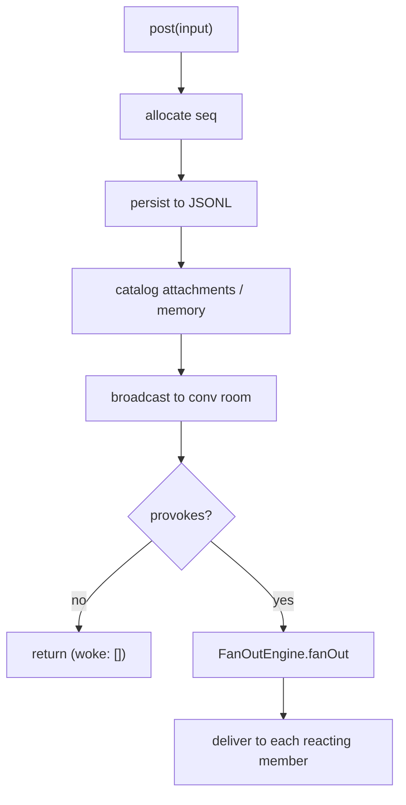

# The Conversation Layer

[< Back to index](./index.md)

The conversation layer is where a message becomes an event that reaches the right
participants. It replaces the old "human talks to Prime, sub-agents relay up"
hardcoding with one path: a Message is posted to a Conversation, and each member's
**reaction predicate** decides whether it runs. This document covers the
`ConversationRouter`, the fan-out engine, memberships, participants, and the
resource catalog.

The relevant code lives under
[apps/server/src/conversation/](../../apps/server/src/conversation).

---

## The entities

- **Conversation** — a transcript plus its membership. Persisted today as a
  `conversations` row (a per-Conversation `seq` counter and its owning agent) plus
  the append-only JSONL log named by its id. Its id is no longer an agent id: a
  fresh uuid for a Conversation, or a legacy agent id whose log the row maps.
- **Participant** — a session-scoped actor identity: `human`, `agent`, or
  `automation` ([participantRegistry.ts](../../apps/server/src/conversation/participantRegistry.ts),
  [participantService.ts](../../apps/server/src/conversation/participantService.ts)).
  Authority rides on capabilities (`orchestrator`), not on kind or a reserved id.
- **Membership** — a `(Participant, Conversation)` attachment carrying the
  reaction predicate, ingress, and transcript visibility
  ([membershipRegistry.ts](../../apps/server/src/conversation/membershipRegistry.ts)).
- **Resource** — session-owned catalogued content referenced into Conversations
  ([resourceCatalog.ts](../../apps/server/src/conversation/resourceCatalog.ts)).

---

## `ConversationRouter`: the one entry point

[ConversationRouter](../../apps/server/src/conversation/conversationRouter.ts) is
the only way a Message enters a Conversation. Every source — a human turn, a
trigger firing, a tool call, a finalized agent turn — goes through `post`:

1. **Allocate the ordinal.** `seq` comes from the store's per-Conversation
   allocator unless a streaming turn already reserved one, so no writer invents an
   order.
2. **Persist**, before broadcasting, so a reconnecting client sees it in history.
3. **Catalog content.** Attachments and memory writes the Message carries are
   mirrored into the resource catalog and referenced into this Conversation.
4. **Broadcast** to the Conversation's room (`chat:message`, or a streamed turn's
   own `agent:end` payload).
5. **Fan out** to whoever reacts — unless `provokes: false` (e.g. a cancelled
   turn, whose content is history, not a request).

### Cross-conversation posts

`postToConversation` writes into a Conversation the author is *not* writing from —
an orchestrator reporting into the human's thread, or issuing a directive in a
worker's. It is authorized: only a participant that holds a Membership there may
post there, and the Message records `source.kind = "relay"` so the log can answer
"did this arrive across a boundary." A relay renders in the UI as a **report**,
not a peer turn. The post stays in its author's fan-out wave whatever its ingress,
which stops two Conversations whose participants wake each other from laundering an
unbounded cycle by changing rooms.

---

## Fan-out and reaction predicates

[FanOutEngine](../../apps/server/src/conversation/fanOut.ts) is the only thing that
decides who runs. It evaluates a Conversation's memberships against the posted
Message and delivers to each one whose predicate matches — the sender is excluded,
and delivery goes through the resolved [connector](./connectors.md). It returns
`{ woke, refused }`: a participant that was addressed and did not wake is the one
outcome indistinguishable from success, so refusals are explicit.

Cascades are bounded: `MAX_WAVE_DEPTH` limits how many hops one chain of automatic
reactions may take (deliberate work — a tool call, a schedule, a callback — starts
a fresh chain), and `MAX_CONVERSATION_REACTIONS` caps reactions dispatched into a
single Conversation.

Predicates are named presets in
[reaction.ts](../../apps/server/src/conversation/reaction.ts), read only over the
Message envelope's structured facts (addressing, provenance, run boundaries) —
never its free-text body:

| Preset       | Reacts when                                    |
| ------------ | ---------------------------------------------- |
| `always`     | every Message in the Conversation (self excluded) |
| `fromHumans` | the author is a human                          |
| `mentionsMe` | the participant is `@mentioned`                |
| `atRunEnd`   | the Message ends its Run                       |
| `never`      | never (a muted or contribute-only member)      |

A stored `ReactionSpec` is one or more presets joined by `+`, read as a
disjunction (`fromHumans+mentionsMe`). **Muting** a member is simply its reaction
set to `never` — moderation falls out of the same primitive that decides who wakes.

---

## Transcript visibility and delivery projection

`deliveryText` ([conversationRouter.ts](../../apps/server/src/conversation/conversationRouter.ts))
projects the text one recipient's transport receives:

- The **owner** of the Conversation (its subject) gets the content as written.
- A member woken **from another Conversation** gets provenance framing (`X posted
  in another conversation:` / `Sub-agent "Y" reported:`).
- An **opaque** member (a far end outside Tangent, such as an A2A peer in a shared
  room) is sent the Message plain: framing situates a Message within a transcript,
  and a member that sees none of the log has nothing to situate it against.

Framing is a projection — what is persisted stays the author's own words.
`TranscriptVisibility` is `shared` | `summarized` | `opaque`; `summarized` is a
declared label today, not yet a mechanism.

---

## No privileged Conversation

There is no reserved "main" thread. The agent that coordinates holds the
`orchestrator` capability, and the UI derives the primary thread from that
capability rather than from the id `"prime"`. `participantForConversation` resolves
a Conversation's owner without assuming its id equals an agent's, which is what lets
a Conversation id be distinct from any agent id.

---

## Resources

[ResourceCatalog](../../apps/server/src/conversation/resourceCatalog.ts) is the one
catalog every content path mirrors into: a pinned artifact, a message attachment, a
memory write, a workspace file. A **ResourceReference** surfaces a resource into a
Conversation. A reference (and the per-Membership `resource_grants` that refine it)
governs **surfacing and citation only** — not filesystem access. Agents read the
workspace through tools against the session root, and a reference does not
interpose on a read or write. Grants are **default-permissive**: a Membership with
no grant rows surfaces the whole reference set, so an empty table changes nothing.

---

## See also

- [connectors.md](./connectors.md) — how a reacting participant is resolved to a
  transport and delivered to.
- [human-prime-subagents.md](./human-prime-subagents.md) — the delegation and
  reporting choreography expressed over this layer.
- [sessions-and-storage.md](./sessions-and-storage.md) — the SQLite tables behind
  these entities.
