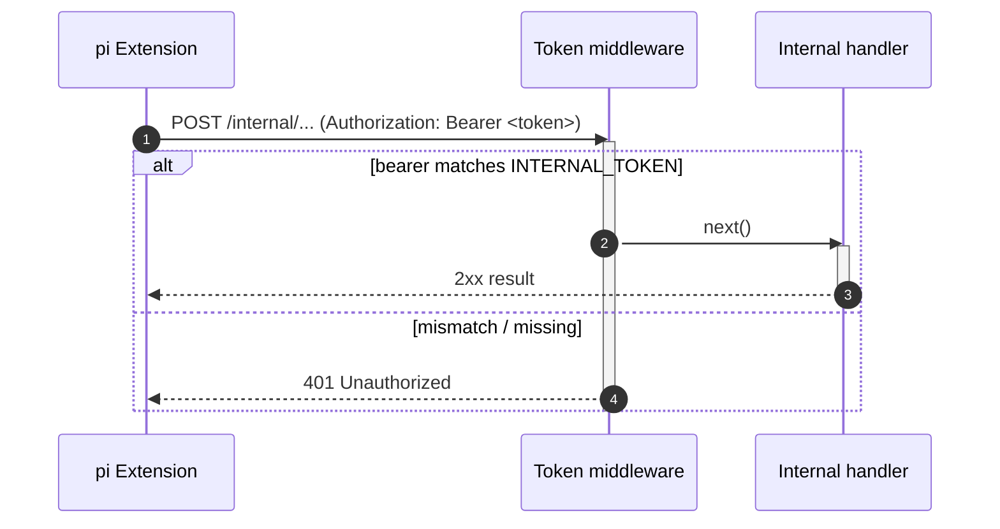
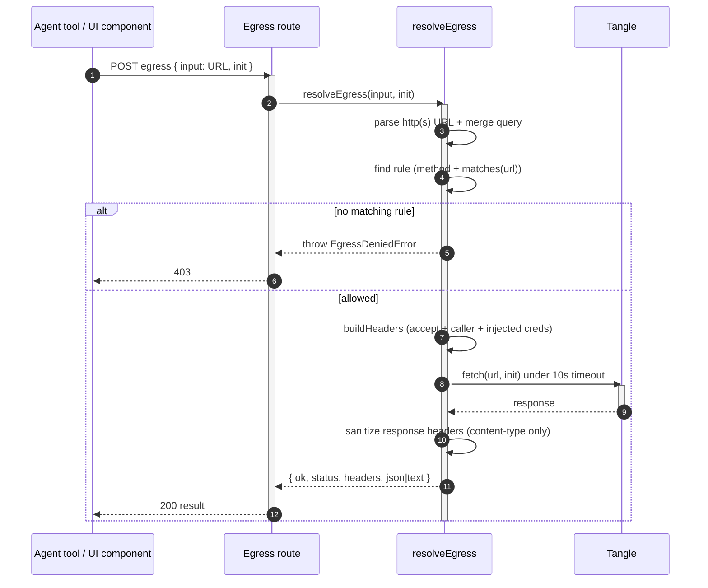

# Egress and Security

[< Back to index](./index.md)

This document covers the server's trust boundaries: the internal-token model
that guards agent-driven APIs, the egress allowlist proxy that lets agents and
sandboxed UI components reach a small set of external endpoints without holding
credentials, the various path-traversal guards, and the trigger-handler worker
isolation. It ends with security findings.

---

## The internal-token trust model

Each `pi` child is spawned with `TANGENT_INTERNAL_URL` and
`TANGENT_INTERNAL_TOKEN` in its environment
([piAgentManager.ts](../../server/src/pi/piAgentManager.ts)). The five always-on
extensions present that token as `Authorization: Bearer <token>` on every call
to the server's internal API.

`INTERNAL_TOKEN` ([config.ts](../../server/src/config.ts)) is a per-start
`randomUUID()` unless pinned via env. Every internal router installs a middleware
that rejects any request whose bearer does not match:

- `/internal/agents` ([internalAgents.ts](../../server/src/routes/internalAgents.ts))
- `/internal/memory` ([internalMemory.ts](../../server/src/routes/internalMemory.ts))
- `/internal/triggers` ([internalTriggers.ts](../../server/src/routes/internalTriggers.ts))
- `/internal/session` ([internalSession.ts](../../server/src/routes/internalSession.ts))
- `/internal/egress` ([internalEgress.ts](../../server/src/routes/internalEgress.ts))

This keeps arbitrary local processes from driving a session's agents, mutating
memory or triggers, renaming sessions, or making egress calls. The token never
leaves the host (the URL defaults to loopback on `PORT`).



---

## The egress allowlist proxy

Agents and sandboxed bundle-UI components must never hold outbound credentials
and must not reach arbitrary hosts. Both go through
[`resolveEgress`](../../server/src/bundleUi/egressAllowlist.ts), which validates
the requested URL against a fixed allowlist, performs the real `fetch`
server-side (injecting credentials), and returns a JSON-safe response with only
allowlisted headers.

Two routes wrap the same resolver:

- `POST /internal/egress` — the **agent-side** proxy (token-guarded), used by
  bundle tool extensions running inside `pi` (e.g. a Tangle API tool).
- `POST /api/agent-bundles/ui-egress` — the **bundle-UI** `host.fetch` proxy used
  by sandboxed UI components.



Allowlist properties:

- Only `http(s)` URLs whose method + parsed URL match a registered `EgressRule`
  are permitted; everything else throws `EgressDeniedError` (403).
- Rules cover the configured Tangle API origin (`TANGLE_API_URL`) for specific
  `pipeline_runs` / `executions` / `artifacts` paths, plus the Tangle execution
  state endpoint. Credentials are injected by the rule's `headers()` so the
  caller never sees them.
- Responses surface only `content-type`; a 10s `AbortController` timeout bounds
  upstream calls; transport failures map to a 502.

---

## Other guards

- **ZIP path traversal** — both the bundle installer (`isSafeEntryPath` in
  [bundleLoader.ts](../../server/src/pi/config/bundleLoader.ts)) and the manifest
  validator (`isSafeRelativePath` in
  [manifest.ts](../../server/src/pi/config/manifest.ts)) reject entries with
  `..`, absolute paths, or drive prefixes, so a malicious archive can't write
  outside the session root.
- **File serving** — the artifact/upload handler validates the session id and
  confines resolved paths to the `artifacts/`/`uploads/` subtrees (see
  [sessions-and-storage.md](./sessions-and-storage.md)).
- **Bundle ids as directory names** — `isUnsafeId` guards both the marketplace
  store and the upload destination.
- **Trigger handler isolation** — compiled trigger handlers run in a worker
  thread with an empty env, a 64 MB heap ceiling, and a 5s wall-clock timeout
  (see [triggers.md](./triggers.md)). This is fault isolation + a hard timeout,
  **not** a sandbox against deliberately malicious code; handlers are trusted
  bundle-author code (same trust model as Pi tool extensions).
- **CORS** — Socket.IO is configured with `cors: { origin: true }` to ease local
  dev where the UI is proxied by Vite (same-origin in practice).

---

## Security findings

### Finding 1 (critical): hardcoded personal `OKTASSO_TOKEN` in source

[server/src/bundleUi/egressAllowlist.ts](../../server/src/bundleUi/egressAllowlist.ts)
currently hardcodes a personal Oktasso JWT directly in `tangleAuthHeaders()`:

```ts
function tangleAuthHeaders(): Record<string, string> {
  return {
    cookie: `OKTASSO_TOKEN=eyJ...<full JWT>...`,
  };
  // unreachable below:
  const token = process.env.TANGLE_TOKEN;
  return token ? { authorization: `Bearer ${token}` } : {};
}
```

Problems:

- A live, personal credential (decoded subject `user@example.com`) is
  committed to the repository. It will be exposed to anyone with repo access and
  in git history.
- The early `return` makes the intended `TANGLE_TOKEN` env path dead code, so the
  hardcoded cookie is attached to **every** allowlisted Tangle egress
  request from any session's agents and UI components.

Recommended remediation:

1. Revoke/rotate the leaked Oktasso token immediately.
2. Remove the hardcoded `cookie` block and restore the `TANGLE_TOKEN` (and
   `TANGLE_AUTH`) env-sourced path so credentials are injected from the
   environment, never from source.
3. Scrub the secret from git history (e.g. `git filter-repo`) since rotating
   alone leaves the old token in history.

### Finding 2 (informational): default-open internal token in misconfigured deploys

`INTERNAL_TOKEN` is a per-start random UUID, which is sound. But because
`INTERNAL_URL` defaults to loopback and the token guards real capabilities,
deployments must ensure the internal routers are not exposed beyond loopback and
that `TANGENT_INTERNAL_TOKEN`, if pinned via env, is treated as a secret.

### Finding 3 (informational): in-memory session store

Session records + chat history are in-memory
([sessions-and-storage.md](./sessions-and-storage.md)); a restart drops them
while on-disk artifacts/uploads/triggers persist. Not a vulnerability, but worth
noting for any deployment that assumes durability.
