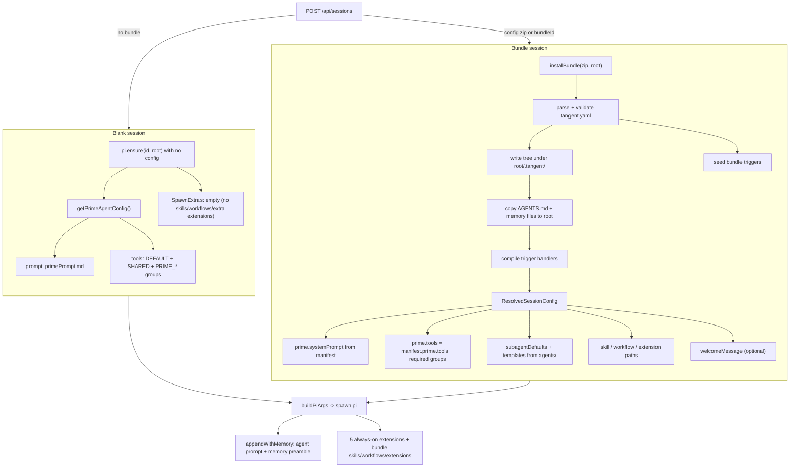
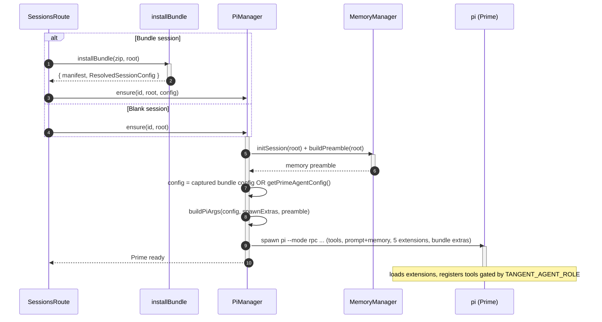

# Extensions and Prompts: Blank vs Bundle Sessions

[< Back to index](./index.md)

Every `pi` process in a session is spawned from an `AgentConfig` (tool allowlist

- appended system prompt) plus a set of `SpawnExtras` (skills, workflows, extra
  extensions). How that config is produced differs between a **blank session**
  (created without a bundle) and a **bundle session** (created from a Configuration
  Bundle). This document explains both paths, the five always-on extensions, the
  per-role tool gating, and the prompt resolution precedence.

The relevant code: [agentConfig.ts](../../server/src/pi/agentConfig.ts),
[piAgentManager.ts](../../server/src/pi/piAgentManager.ts) (`buildPiArgs`,
`spawnExtras`, `appendWithMemory`),
[config/bundleLoader.ts](../../server/src/pi/config/bundleLoader.ts), and
[utils.ts](../../server/src/pi/utils.ts) (the extension paths).

---

## The five always-on extensions

Regardless of how a session is created, `buildPiArgs` adds these five
`--extension` paths to every agent (Prime and sub-agents). They are authored
against Pi's extension runtime (`@ts-nocheck`, never imported by the server) and
are thin clients over the server's `/internal/*` API:

| Extension      | File                                                                           | Tools registered                                                                                         | Role gating           |
| -------------- | ------------------------------------------------------------------------------ | -------------------------------------------------------------------------------------------------------- | --------------------- |
| Orchestrator   | [extensions/orchestrator.ts](../../server/src/pi/extensions/orchestrator.ts)   | `read_room`; `message_prime`; `spawn_subagent` / `message_subagent` / `kill_subagent` / `list_subagents` | all; sub-agent; Prime |
| Proxy provider | [extensions/proxyProvider.ts](../../server/src/pi/extensions/proxyProvider.ts) | registers `anthropic`/`openai`/`google`/`groq`/`xai` providers against `PI_PROXY_URL`                    | n/a (no tools)        |
| Memory         | [extensions/memory.ts](../../server/src/pi/extensions/memory.ts)               | `read_memory`; `remember` / `suggest_memory`                                                             | all; Prime            |
| Triggers       | [extensions/triggers.ts](../../server/src/pi/extensions/triggers.ts)           | `create_trigger` / `list_triggers` / `enable_trigger` / `disable_trigger` / `delete_trigger`             | Prime only            |
| Session        | [extensions/session.ts](../../server/src/pi/extensions/session.ts)             | `pin_artifact`; `rename_session`                                                                         | all; Prime            |

Each extension reads `TANGENT_AGENT_ROLE` and only registers the higher-privilege
tools when the role is `prime`. The proxy-provider extension exists because in a
container (`HOME=/tmp`) Pi has no auto-discovered provider config, so it would
otherwise fail to reach any model.

### Why extension tools must also be in `--tools`

Pi's `--tools` allowlist filters **extension and custom tools too**, not just
built-ins. So if `spawn_subagent` (registered by the orchestrator extension) is
not listed in Prime's allowlist, Pi strips it even though the extension
registered it. That is why `agentConfig.ts` defines tool-name groups that are
unioned into the allowlist:

- `DEFAULT_TOOLS` = `read, write, edit, bash, grep, find, ls`.
- `SHARED_AGENT_TOOLS` = `read_room, read_memory, message_prime, pin_artifact`
  (granted to every agent, even though `message_prime` is only _registered_ for
  sub-agents — the allowlist must still permit it).
- `PRIME_ORCHESTRATION_TOOLS`, `PRIME_MEMORY_TOOLS`, `PRIME_TRIGGER_TOOLS`,
  `PRIME_SESSION_TOOLS` — Prime-only tool names.

---

## Blank vs bundle: how the config is built

### Blank session path

When `POST /api/sessions` carries no bundle, the route calls
`pi.ensure(session.id, session.rootPath)` with **no** config
([routes/sessions.ts](../../server/src/routes/sessions.ts)). The manager spawns
Prime with `session.config?.prime ?? getPrimeAgentConfig()`. Since there's no
session config:

- **Prime prompt** = [primePrompt.md](../../server/src/pi/primePrompt.md) (the
  orchestration prompt: operating rules, sub-agent orchestration, artifacts,
  session naming, memory).
- **Prime tools** = `DEFAULT_TOOLS` + `SHARED_AGENT_TOOLS` +
  `PRIME_ORCHESTRATION_TOOLS` + `PRIME_MEMORY_TOOLS` + `PRIME_TRIGGER_TOOLS` +
  `PRIME_SESSION_TOOLS`.
- **SpawnExtras** = empty (`spawnExtras(undefined)` returns empty arrays), so no
  `--skill` / `--prompt-template` / extra `--extension` flags.
- **Sub-agents** spawned later resolve against the **global** templates
  ([server/src/pi/agents/](../../server/src/pi/agents)) and the base
  [systemPrompt.md](../../server/src/pi/systemPrompt.md).

### Bundle session path

When the request carries a multipart `config` ZIP or a marketplace `bundleId`,
`createSessionFromBundle` calls `installBundle` and then
`pi.ensure(id, root, config)` with the resolved config. The
`ResolvedSessionConfig` ([agentConfig.ts](../../server/src/pi/agentConfig.ts))
drives every spawn:

- **Prime prompt** = the bundle's `prime.systemPrompt` file.
- **Prime tools** = `manifest.prime.tools` (or `DEFAULT_TOOLS`) unioned with
  `SHARED_AGENT_TOOLS` + the Prime-only groups (`resolvePrimeTools`). So a bundle
  never needs to list orchestration/memory/session tools; they're always added.
- **subagentDefaults** = `{ tools, appendSystemPrompt }` from the manifest's
  `subagents` block.
- **templates** = parsed from the installed `.tangent/agents/*.md`.
- **skillPaths / workflowPaths / extensionPaths** = absolute paths resolved
  against the installed tree, passed as repeated `--skill` (dir containing
  `SKILL.md`), `--prompt-template`, and extra `--extension` flags to **every**
  agent in the session.
- **welcomeMessage** (optional) = pre-seeded as Prime's first message so the
  agent "speaks first" (no LLM call) on join.

Additionally, the bundle's `AGENTS.md` (rules) and seed memory/context files are
copied to the workspace root so Pi auto-discovers them from `cwd`, and the
bundle's declared triggers are seeded into the session. See
[configuration-bundles.md](./configuration-bundles.md).

---

## Sequence: spawning Prime in each mode

---

## Sub-agent prompt + tool resolution precedence

When Prime spawns a sub-agent, `resolveSubagentConfig(request, { templates,
defaults })` resolves the effective config:

- **Tools** (`pickTools`): inline `request.tools` > template `tools` >
  session/bundle `defaults.tools` > `DEFAULT_TOOLS`. Then `SHARED_AGENT_TOOLS`
  are always merged in (deduped).
- **System prompt** (`pickPrompt`): inline `request.systemPrompt` > template
  `systemPrompt` > `defaults.appendSystemPrompt` > the global base
  `systemPrompt.md`.
- **Templates** come from the session's bundle (`session.config.templates`) when
  present, otherwise the global cached templates.

In all cases the spawned sub-agent's appended prompt is then joined with the
current memory preamble by `appendWithMemory`, so every agent starts each session
aware of its global + session memory (see [memory.md](./memory.md)).
