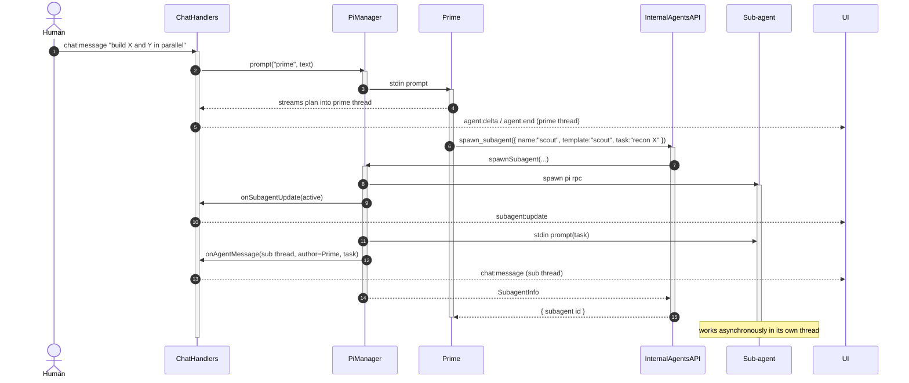
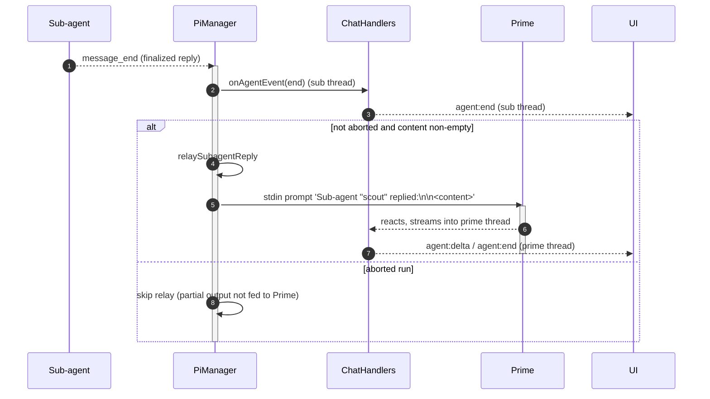
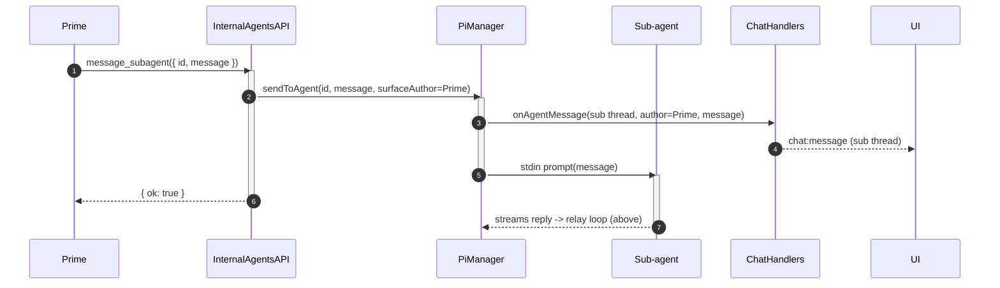
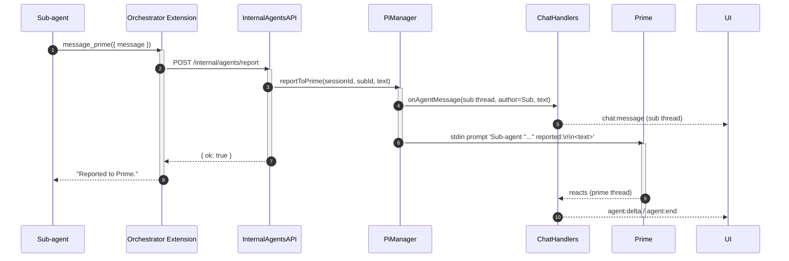

# Human <-> Prime <-> Sub-agent Protocols

[< Back to index](./index.md)

This document covers the choreography between the actors in a session: the
**human**, the session's **Prime** agent, and the **sub-agents** Prime spawns.
It is the common Prime-in-the-middle shape of the general
[conversation layer](./conversations.md): delegation and relay are no longer
hardcoded routes but ordinary fan-out over memberships and reaction predicates.
It builds on the mechanics in [orchestrator.md](./orchestrator.md).

## The roles and the rules

Routing is decided by each participant's **Membership** — its reaction predicate
over the [conversation layer](./conversations.md) — not by hardcoded "who talks to
whom" branches. In a default session that configuration produces the familiar
Prime-centric behavior:

- **Prime reacts to the human by default.** A human's `chat:message` posts into a
  Conversation and fans out; Prime's membership reacts, so it runs. A human can
  also address a specific member with an `@mention` (resolved to a participant id
  at write time) or write into a sub-agent's thread to steer or follow up an
  in-flight run. Prime still holds the `orchestrator` capability that grants
  spawning and directing sub-agents.
- **The orchestrator capability gates the spawn tools.** The agent holding
  `orchestrator` (Prime today) gets `spawn_subagent`, `message_subagent`,
  `kill_subagent`, and `list_subagents`; a plain sub-agent holds none.
- **Sub-agents read the room and report up.** Every agent has `read_room`; a
  sub-agent's own upward channel is `message_prime`. Coordination between
  sub-agents still goes through the orchestrator — but this is a consequence of
  how their memberships are configured, not a special case in the router.
- **Heterogeneous members fall out of the same mechanism.** An agent reached over
  A2A is an ordinary member with its own reaction predicate (opaque by default),
  not something the orchestrator proxies for. See [connectors.md](./connectors.md).
- **All work shares one workspace.** Every local agent's `cwd` is the same session
  root folder, so sub-agents see each other's files.

## Transcript threading

Every message carries a `conversationId` — a Conversation id. In a default
session Prime's home Conversation is the main human/Prime thread and each
sub-agent has its own; the ids are no longer required to equal an agent id (see
[conversations.md](./conversations.md)). Each Conversation has its own Socket.IO
room, and a client receives only the Conversations its participant is authorized
for. Directed tasks (Prime -> sub) and reports (sub -> Prime) are surfaced into
the relevant thread — a report renders as a relay — while also being delivered to
the target so it reacts.

---

## Sequence: delegation (spawn + initial task)



Prime can spawn multiple sub-agents back-to-back to run independent subtasks in
parallel; each is an independent process with its own context window.

---

## Sequence: the async relay loop

Sub-agents work asynchronously. Prime is event-driven — it only acts when
prompted. So every finalized sub-agent message is relayed back into Prime's
stdin as it lands (`relaySubagentReply` in `finalizeMessage`), which closes the
loop without Prime having to poll.



If the relayed sub-agent reply arrives while Prime is mid-run, `sendToAgent`
attaches `streamingBehavior: "followUp"` (the `"auto"` default) so Pi queues it
rather than dropping it. Human nudges can instead pass `delivery: "steer"` to
apply before the agent's next LLM call.

---

## Sequence: `message_subagent` (Prime -> sub, directed task)



This is non-blocking from Prime's perspective: the tool returns immediately and
the sub-agent's reply later flows back through the relay loop.

---

## Sequence: `message_prime` (sub -> Prime, mid-run report)

A sub-agent uses `message_prime` to push a milestone directly to Prime without
waiting for its run to finish (e.g. "submitted run id 123"). This is the only
upward channel a sub-agent has.



The difference from the automatic relay: `message_prime` is sub-agent-initiated
and attributed to the sub-agent; the automatic relay fires for _every_ finalized
sub-agent message regardless, so milestones aren't dropped even if the sub-agent
never calls `message_prime`.

---

## Sequence: abort vs kill

Aborting stops the current run but keeps the agent; killing removes the agent
from the roster entirely.

```mermaid
sequenceDiagram
  autonumber
  actor Human
  participant Handlers as ChatHandlers
  participant PiManager
  participant Prime
  participant Internal as InternalAgentsAPI
  participant Sub as Sub-agent
  participant UI

  Note over Human,Sub: ABORT (cancel an in-progress run)
  Human->>Handlers: agent:abort { conversationId }
  activate Handlers
  Handlers->>PiManager: abort(sessionId, agentId)
  activate PiManager
  PiManager->>PiManager: aborted = true
  PiManager->>Sub: stdin abort
  activate Sub
  Sub-->>PiManager: agent_end
  deactivate Sub
  PiManager->>PiManager: finalize skips relay (aborted)
  PiManager-->>UI: agent:activity null
  deactivate PiManager
  deactivate Handlers

  Note over Prime,Sub: KILL (Prime retires a sub-agent)
  Prime->>Internal: kill_subagent({ id, completed })
  activate Internal
  Internal->>PiManager: killAgent(id, completed)
  activate PiManager
  PiManager->>PiManager: status = completed ? "completed" : "killed"; drop from roster
  PiManager->>Sub: child.kill()
  PiManager->>Handlers: onSubagentUpdate(terminal status)
  activate Handlers
  Handlers-->>UI: subagent:update
  deactivate Handlers
  PiManager-->>Internal: ok
  deactivate PiManager
  Internal-->>Prime: "Terminated sub-agent ..."
  deactivate Internal
```

A crash (process `error`/`exit`) is handled like an implicit kill: `removeAgent`
transitions a still-`active` sub-agent to `error` status and broadcasts the
roster update, while `failInFlight` emits an `agent:error` for any message that
was streaming.

---

## Sub-agent templates

`spawn_subagent` may name a `template` to seed tools + system prompt. The global
templates ship under
[server/src/pi/agents/](../../server/src/pi/agents) (`scout`, `planner`,
`reviewer`, `worker`); a bundle can override or add templates via its `agents/`
directory. Resolution precedence (`resolveSubagentConfig` in
[agentConfig.ts](../../server/src/pi/agentConfig.ts)): inline request > template

> bundle/session default > global base. `read_room` (and the other shared tools)
> are always merged into the allowlist so the extension's tool is never filtered
> out. See [extensions-and-prompts.md](./extensions-and-prompts.md) for the full
> resolution rules.
