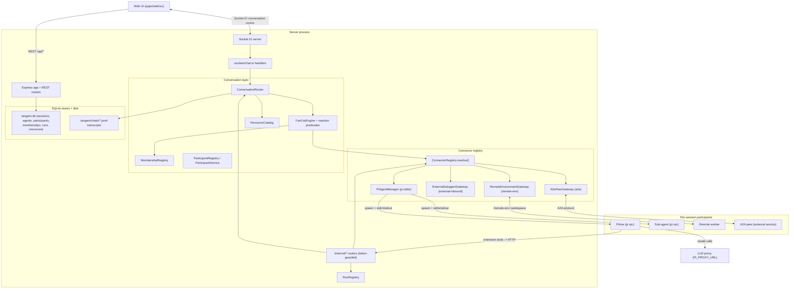

# Tangent Server Architecture Review

This documentation set is an architecture review of the Tangent dev server
(everything under [`apps/server/`](../../apps/server)). It is centered on the
**conversation layer** — the subsystem that routes every message between the
participants of a session (humans, the session's **Prime** agent, spawned
sub-agents, and agents that run outside Tangent) and delivers each one to
whoever reacts.

The server is a single Node process that exposes two transports to the web UI
(Express REST + Socket.IO) and, per session, drives a set of **connectors** —
local `pi --mode rpc` child processes, a remote-environment gateway, an
external-inbound gateway, and an A2A peer gateway. Agents reach back into the
server through a token-guarded internal HTTP API, which is what makes
orchestration, memory, triggers, resources, and session control possible.

Session metadata, the participant roster, memberships, runs, and the resource
catalog are persisted in a SQLite database; chat transcripts are append-only
JSONL files on disk. Both survive a restart.

## Table of contents

| Doc                                                      | What it covers                                                                                                                        |
| -------------------------------------------------------- | ------------------------------------------------------------------------------------------------------------------------------------- |
| [ui-server-protocol.md](./ui-server-protocol.md)         | The full UI <-> Server protocol: REST surface, Socket.IO event catalog, and the chat/stream/join sequences.                           |
| [conversations.md](./conversations.md)                   | The conversation layer: `ConversationRouter`, the fan-out engine, reaction predicates, memberships, participants, and resources.      |
| [connectors.md](./connectors.md)                         | The connector registry: how a participant is resolved to a transport, connector facets, runs, and the four connector implementations. |
| [orchestrator.md](./orchestrator.md)                     | The local Pi connector: `PiAgentManager`, the `pi` RPC stdin/stdout protocol, the stdout event dispatch table, and the callback loop. |
| [human-prime-subagents.md](./human-prime-subagents.md)   | The Human / Prime / Sub-agent choreography: delegation, reaction-driven relay, reporting, abort, kill.                                |
| [extensions-and-prompts.md](./extensions-and-prompts.md) | How extensions and prompts are applied for a blank session vs a bundle-based session.                                                 |
| [configuration-bundles.md](./configuration-bundles.md)   | The Configuration Bundle format, install pipeline, and the marketplace store.                                                         |
| [triggers.md](./triggers.md)                             | The trigger subsystem: manager, engine, scheduling, callbacks, and signal-to-prompt resolution.                                       |
| [memory.md](./memory.md)                                 | Global + session memory stores, the injected preamble, and the suggest/confirm flow.                                                  |
| [sessions-and-storage.md](./sessions-and-storage.md)     | The session model, the `SessionStore` abstraction, the SQLite schema, the per-session root folder, and the file server.               |
| [egress-and-security.md](./egress-and-security.md)       | The internal-token trust model, the egress allowlist proxy, sandboxing, and security findings.                                        |

## Component map

## Dependency-injection wiring (`index.ts`)

Everything is constructed once at startup and wired by hand in
[apps/server/src/index.ts](../../apps/server/src/index.ts). There is no DI
container; the composition root instantiates the singletons and passes them where
needed. Opening the database applies any pending drizzle migrations first.

- `db = openDb()` — the single shared SQLite connection; applies migrations on
  startup.
- `participants = new SqliteParticipantStore(db)`, `resourceStore = new
SqliteResourceStore(db)`, `membershipStore = new SqliteMembershipStore(db)` —
  the relational stores for the roster, catalog, and memberships.
- `store = new SqliteSessionStore(db, participants, resourceStore)` — the durable
  session store backing REST routes and socket handlers.
- `agentBundleStore = new FileAgentBundleStore()` — the filesystem-backed
  marketplace of saved bundles.
- `memory = new MemoryManager()` — the global + per-session memory files.
- `triggers = new TriggerManager()` — per-session trigger definitions and their
  on-disk persistence.
- `memberships = new MembershipRegistry(store, membershipStore, …)` — who is in
  each Conversation and what each reacts to; derives rows from the roster on a
  cache miss so a legacy session still resolves.
- `participantRegistry = new ParticipantRegistry(store, participants)` — the read
  surface over the `participants` table, reconciled with the agent roster.
- `resourceCatalog = new ResourceCatalog(resourceStore)` — the catalog every
  content path (a pinned artifact, an attachment, a memory write) mirrors into.
- `conversations = new ConversationRouter(io, store, memberships, resourceCatalog)`
  — **the one way a Message enters a Conversation**: persist, broadcast, then
  fan out to whoever reacts.
- `agentHandlers: ConversationEventSink` — the shared sink
  (`onAgentEvent` / `onSubagentUpdate` / `onAgentMessage` / `onSessionStatus`)
  that relays a participant's streaming events, roster changes, and posted
  messages the same way whether it runs locally, remotely, or entirely outside
  Tangent.
- `runs = new RunRegistry(new SqliteRunStore(db))` — tracks which participant is
  working under which run id; settles stale runs left by a previous process.
- `pi = new PiAgentManager(agentHandlers, memory, runs, hostResourcePreamble)` —
  the roster of Pi processes per session (the local connector).
- `remoteGateway`, `externalGateway`, `a2aGateway` — the other three connector
  gateways, all sharing `agentHandlers` and `runs`.
- `connectors = createConnectorRegistry(pi, remoteGateway, externalGateway,
a2aGateway, agentHandlers)` — the single, total lookup from a participant to
  its connector; `conversations.useConnectors(connectors)` closes the wiring
  cycle.
- `participantService = new ParticipantService(…)` — the lifecycle of humans,
  automations, and memberships: invitation, presence, revocation, join/leave/mute.
- `triggerEngine = new TriggerEngine(io, store, pi, triggers, conversations,
participantService)` — arms schedule timers and posts firings into the target's
  Conversation through the router.

The Express app mounts:

- `GET /api/health`
- `/api/sessions` -> `createSessionsRouter(store, pi, triggers, triggerEngine, agentBundleStore, participantService, resourceCatalog, memory, hostResourcePreamble, emitResourcesUpdated)`
- `/api/agent-bundles` -> `createAgentBundlesRouter(agentBundleStore)`
- `/api/global-memory` -> `createGlobalMemoryRouter(memory)`
- `/api/mcp` -> `createMcpRelayRouter(mcpRelay, relayReport)` (public MCP relay dialed by an external client)
- `/api/me` -> `createMeRouter()` (resolves the current user from an auth JWT cookie)
- `/api/embed` -> `createEmbedRouter(store)`
- `/internal/agents` -> `createInternalAgentsRouter(store, connectors, conversations, a2aGateway, participantService)`
- `/internal/external-agents` -> `createInternalExternalAgentsRouter(externalGateway)`
- `/internal/egress` -> `createInternalEgressRouter()`
- `/internal/triggers` -> `createInternalTriggersRouter(store, triggers, triggerEngine)`
- `/internal/memory` -> `createInternalMemoryRouter(store, memory, onMemoryRemembered, onMemorySuggestion)`
- `/internal/resources` -> `createInternalResourcesRouter(store, resourceCatalog)`
- `/internal/session` -> `createInternalSessionRouter(store, emitUiCommand)`
- `/internal/mcp-relay` -> `createInternalMcpRelayRouter(mcpRelay, store)`
- `/internal/remote-tools` -> `createInternalRemoteToolsRouter(remoteGateway)`

Finally `registerChatHandlers(...)` attaches the Socket.IO connection handlers,
and `SIGINT`/`SIGTERM` call `pi.disposeAll()` to kill every child process before
exit.

## Topology model

- **A session owns Conversations, Participants, and Resources.** Prime is the
  default face of a new session and holds the `orchestrator` capability, but a
  session can hold several participants (more humans, specialist agents,
  automations) across one or more Conversations.
- **A Conversation is a transcript plus its membership.** Its id is no longer an
  agent id: several participants can share one Conversation, and one participant
  can belong to several. Legacy agent-id-named transcripts stay valid because the
  `conversations` table maps them.
- **One Socket.IO room per Conversation.** A Message for a Conversation is
  delivered to `conv:<sessionId>:<conversationId>`, and a socket joins only the
  Conversation rooms its participant is authorized for — so who receives a Message
  is a server-side decision derived from Membership, not a client-side filter.
  Session-level events (roster, presence, triggers, artifacts) still use the
  session-wide room `session:<id>`. Setting `ROOM_PER_CONVERSATION=0` falls back
  to the single session room as a rollback.
- **Durable state, on-disk transcripts.** Sessions, the agent roster,
  participants, memberships, runs, and the resource catalog live in
  `tangent.db`; chat transcripts are append-only JSONL under each session's
  `.tangent/chats/`. Both survive a restart.

## Request lifecycle (summary)

1. The UI creates a session over REST (`POST /api/sessions`), optionally from a
   bundle. The server makes the session's root folder and (lazily) spawns Prime.
2. The UI opens a Socket.IO connection, emits `chat:join`, and subscribes to the
   Conversations its participant may see. The server joins those rooms, ensures
   Prime is running, re-arms triggers, and replays each Conversation's history +
   the roster + presence + trigger roster + pinned resources.
3. The UI emits `chat:message`. It reaches the `ConversationRouter`, which
   persists and broadcasts the Message, then fans it out: each Membership's
   reaction predicate decides whether that participant runs, and the resolved
   connector delivers to those that do.
4. A woken agent streams stdout/protocol events; the connector relays them through
   `ConversationEventSink` into `agent:start` / `agent:delta` / `agent:thinking` /
   `agent:end` / `agent:activity`, each attributed to a Run.
5. When an agent spawns/messages participants, calls memory/trigger/session/
   resource tools, or pins artifacts, the loaded extensions call the `/internal/*`
   API, which mutates state and broadcasts the appropriate events.

See [conversations.md](./conversations.md), [connectors.md](./connectors.md),
[ui-server-protocol.md](./ui-server-protocol.md) and [orchestrator.md](./orchestrator.md)
for the detailed sequences.

## The internal API + bearer-token model

Every `pi` child is spawned with `TANGENT_INTERNAL_URL` and
`TANGENT_INTERNAL_TOKEN` in its environment
([apps/server/src/pi/piAgentManager.ts](../../apps/server/src/pi/piAgentManager.ts)).
The extensions present that token as `Authorization: Bearer <token>` on every
call to `/internal/*`. Each internal router rejects requests whose bearer does not
match `INTERNAL_TOKEN`, which is a per-start `randomUUID()` unless pinned via env
([apps/server/src/config.ts](../../apps/server/src/config.ts)). This keeps
arbitrary local processes from driving a session's agents, memory, triggers, or
resources. Details in [egress-and-security.md](./egress-and-security.md).

## Configuration / environment surface

From [apps/server/src/config.ts](../../apps/server/src/config.ts):

- `PORT` (default `8787`) — Vite proxies `/api` and `/socket.io` here in dev.
- `SESSIONS_ROOT` (default `<cwd>/.sessions`) — each session gets `<root>/<id>`.
- `SESSIONS_DB` (default `<SESSIONS_ROOT>/tangent.db`) — the SQLite metadata DB.
- `AGENT_BUNDLES_ROOT` (default `<cwd>/.agent-bundles`) — marketplace storage.
- `GLOBAL_MEMORY_DIR` (default `<cwd>/.memory`) + `GLOBAL_MEMORY_FILENAME`
  (`GLOBAL_MEMORY.md`) and `SESSION_MEMORY_FILENAME` (`MEMORY.md`).
- `ARTIFACTS_DIRNAME` (`artifacts`) and `UPLOADS_DIRNAME` (`uploads`) — the only
  per-session subtrees served over HTTP.
- `PI_BIN` (`pi`), `PI_PROVIDER`, `PI_MODEL`, `PI_THINKING`, `PI_PROXY_URL`,
  `PI_DEBUG` (on by default).
- `ROOM_PER_CONVERSATION` (on by default) — per-Conversation delivery; set to
  `0` to fall back to a single session room.
- `INTERNAL_URL` (loopback on `PORT`) + `INTERNAL_TOKEN` (per-start UUID).
- `REMOTE_ENV_TOKEN` / `REMOTE_ENV_SIGNING_SECRET` — auth for the remote-env
  connector; `A2A_TOKEN` — the outbound bearer for A2A peers.
- `EMBED_ALLOWED_ORIGINS` — cross-origin embed hosts (CORS + Socket.IO handshake).
- `TANGLE_API_URL` — origin for the egress allowlist.

## Glossary

- **Session** — the unit of workspace, identity, and lifetime; owns Conversations,
  Participants, and Resources.
- **Conversation** — a transcript plus its membership; the unit of "who sees this
  and who reacts." Its id is not an agent id.
- **Participant** — a session-scoped actor identity: `human`, `agent`, or
  `automation`. Authority rides on capabilities, not kind.
- **Prime** — the session's default orchestrator agent; holds the `orchestrator`
  capability rather than being privileged by a reserved id. Default id `"prime"`.
- **Sub-agent** — a specialized agent spawned into the session; its own context
  window and thread, sharing the session workspace.
- **Membership** — a `(Participant, Conversation)` attachment carrying the reaction
  predicate, ingress, and transcript visibility.
- **Reaction predicate** — the rule that decides whether a participant wakes on a
  Message (`always`, `fromHumans`, `mentionsMe`, `atRunEnd`, `never`).
- **Connector** — the transport behind a participant: `pi-stdio`, `remote-env`,
  `external-inbound`, or `a2a`.
- **Run** — one unit of work by one participant: what a stream of `agent:*` events
  is attributable to, and what cancellation acts on.
- **Resource** — session-owned catalogued content: `file`, `memory`, `attachment`,
  or `artifact`.
- **Room** — a Socket.IO room. `conv:<sessionId>:<conversationId>` carries a
  Conversation's Messages; `session:<id>` carries session-level events.
- **Trigger** — a per-session rule that turns an external signal into a prompt
  delivered to its target.
- **Artifact** — a user-facing file an agent writes under `artifacts/`, catalogued
  as a Resource and pinnable to the UI's quick-access list.
- **Extension** — a `pi` plugin (loaded via `--extension`); here, thin clients over
  the server's internal API.
