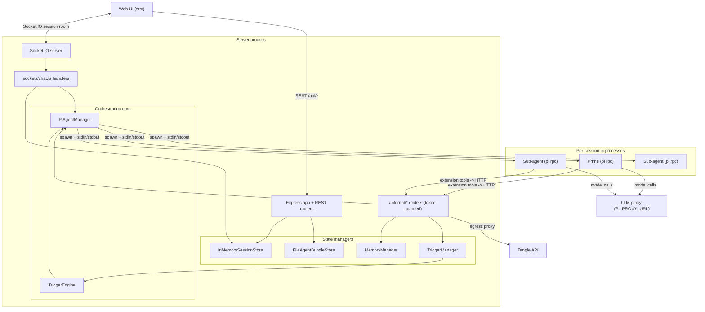

# Tangent Server Architecture Review

This documentation set is a comprehensive architecture review of the Tangent dev
server (everything under [`server/`](../../server)). It is centered on the
**orchestrator** — the subsystem that runs a roster of `pi` coding-agent
processes per session and routes messages between the human, the session's
**Prime** agent, and the **sub-agents** Prime spawns.

The server is a single Node process that exposes two transports to the web UI
(Express REST + Socket.IO) and manages, per session, one or more long-lived
`pi --mode rpc` child processes. The agents reach back into the server through a
token-guarded internal HTTP API, which is what makes orchestration, memory,
triggers, session rename, and artifact pinning possible.

## Table of contents

| Doc                                                      | What it covers                                                                                                                           |
| -------------------------------------------------------- | ---------------------------------------------------------------------------------------------------------------------------------------- |
| [ui-server-protocol.md](./ui-server-protocol.md)         | The full UI <-> Server protocol: REST surface, Socket.IO event catalog, and the chat/stream sequence diagrams (**requested diagram 1**). |
| [orchestrator.md](./orchestrator.md)                     | The core: `PiAgentManager`, the `pi` RPC stdin/stdout protocol, the stdout event dispatch table, and the internal callback loop.         |
| [human-prime-subagents.md](./human-prime-subagents.md)   | The Human <-> Prime <-> Sub-agent protocols: delegation, async relay, reporting, abort, kill (**requested diagram 3**).                  |
| [extensions-and-prompts.md](./extensions-and-prompts.md) | How extensions and prompts are applied for a blank session vs a bundle-based session (**requested diagram 2**).                          |
| [configuration-bundles.md](./configuration-bundles.md)   | The Configuration Bundle format, install pipeline, and the marketplace store.                                                            |
| [triggers.md](./triggers.md)                             | The trigger subsystem: manager, engine, scheduling, callbacks, and signal-to-prompt resolution.                                          |
| [memory.md](./memory.md)                                 | Global + session memory stores, the injected preamble, and the suggest/confirm flow.                                                     |
| [sessions-and-storage.md](./sessions-and-storage.md)     | The session model, the `SessionStore` abstraction, the per-session root folder, and the artifact/upload file server.                     |
| [egress-and-security.md](./egress-and-security.md)       | The internal-token trust model, the egress allowlist proxy, sandboxing, and security findings.                                           |

## Component map

## Dependency-injection wiring (`index.ts`)

Everything is constructed once at startup and wired by hand in
[server/src/index.ts](../../server/src/index.ts). There is no DI container; the
composition root simply instantiates the singletons and passes them where
needed.

- `store = new InMemorySessionStore()` — backs both REST routes and socket
  handlers (sessions, chat history, pinned artifacts).
- `agentBundleStore = new FileAgentBundleStore()` — the filesystem-backed
  marketplace of saved bundles.
- `memory = new MemoryManager()` — owns the global + per-session memory files.
- `triggers = new TriggerManager()` — owns per-session trigger definitions and
  their on-disk persistence.
- `pi = new PiAgentManager({ onAgentEvent, onSubagentUpdate, onAgentMessage }, memory)`
  — runs the roster of `pi` processes; its three handlers are the bridge that
  relays streaming events, roster changes, and directed messages into the
  matching Socket.IO room (built by `createAgentEventHandler` /
  `createSubagentUpdateHandler` / `createAgentMessageHandler` in
  [server/src/sockets/chat.ts](../../server/src/sockets/chat.ts)).
- `triggerEngine = new TriggerEngine(io, store, pi, triggers)` — arms schedule
  timers and delivers trigger firings to Prime as if they were human turns.

The Express app mounts:

- `GET /api/health`
- `/api/sessions` -> `createSessionsRouter(store, pi, triggers, triggerEngine, agentBundleStore)`
- `/api/agent-bundles` -> `createAgentBundlesRouter(agentBundleStore)`
- `/internal/agents` -> `createInternalAgentsRouter(store, pi)`
- `/internal/egress` -> `createInternalEgressRouter()`
- `/internal/triggers` -> `createInternalTriggersRouter(store, triggers, triggerEngine)`
- `/internal/memory` -> `createInternalMemoryRouter(store, memory, onMemoryRemembered, onMemorySuggestion)`
- `/internal/session` -> `createInternalSessionRouter(store, emitUiCommand)`

Finally `registerChatHandlers(...)` attaches the Socket.IO connection handlers,
and `SIGINT`/`SIGTERM` call `pi.disposeAll()` to kill every child process before
exit.

## Topology model

- **One process per session per agent.** A session has exactly one Prime; Prime
  may spawn N sub-agents at runtime. Each is a separate `pi --mode rpc` OS
  process whose `cwd` is the session's scoped root folder.
- **One Socket.IO room per session** (`session:<id>`). All of a session's
  events (Prime's thread plus every sub-agent's thread) are broadcast to that
  one room; the client buckets messages into transcripts by `conversationId`.
- **In-memory session state, on-disk side effects.** Sessions, chat history, and
  pinned artifacts live in memory and are lost on restart. Triggers, memory
  files, the installed bundle tree, artifacts, and uploads all persist on disk
  under the session root, so much of a session can be re-armed after a restart.

## Request lifecycle (summary)

1. The UI creates a session over REST (`POST /api/sessions`), optionally from a
   bundle. The server makes the session's root folder and (lazily) spawns Prime.
2. The UI opens a Socket.IO connection and emits `chat:join`. The server joins
   the room, ensures Prime is running, re-arms triggers, and replays history +
   the sub-agent roster + each live agent's current activity + the trigger roster
   - the pinned-artifact list.
3. The UI emits `chat:message`. The server persists + broadcasts it, then writes
   a `prompt` RPC command to Prime's stdin.
4. Prime streams stdout events; `PiAgentManager` parses them and calls back into
   the chat handlers, which broadcast `agent:start` / `agent:delta` /
   `agent:thinking` / `agent:end` / `agent:activity` to the room.
5. If Prime spawns/messages sub-agents, calls memory/trigger/session tools, or
   pins artifacts, the loaded extensions call the server's `/internal/*` API,
   which mutates state and broadcasts the appropriate events.

See [ui-server-protocol.md](./ui-server-protocol.md) and
[orchestrator.md](./orchestrator.md) for the detailed sequences.

## The internal API + bearer-token model

Every `pi` child is spawned with `TANGENT_INTERNAL_URL` and
`TANGENT_INTERNAL_TOKEN` in its environment
([server/src/pi/piAgentManager.ts](../../server/src/pi/piAgentManager.ts)). The
extensions present that token as `Authorization: Bearer <token>` on every call
to `/internal/*`. Each internal router rejects requests whose bearer does not
match `INTERNAL_TOKEN`, which is a per-start `randomUUID()` unless pinned via env
([server/src/config.ts](../../server/src/config.ts)). This keeps arbitrary local
processes from driving a session's agents, memory, or triggers. Details in
[egress-and-security.md](./egress-and-security.md).

## Configuration / environment surface

From [server/src/config.ts](../../server/src/config.ts):

- `PORT` (default `8787`) — Vite proxies `/api` and `/socket.io` here in dev.
- `SESSIONS_ROOT` (default `<cwd>/.sessions`) — each session gets `<root>/<id>`.
- `AGENT_BUNDLES_ROOT` (default `<cwd>/.agent-bundles`) — marketplace storage.
- `GLOBAL_MEMORY_DIR` (default `<cwd>/.memory`) + `GLOBAL_MEMORY_FILENAME`
  (`GLOBAL_MEMORY.md`) and `SESSION_MEMORY_FILENAME` (`MEMORY.md`).
- `ARTIFACTS_DIRNAME` (`artifacts`) and `UPLOADS_DIRNAME` (`uploads`) — the only
  per-session subtrees served over HTTP.
- `PI_BIN` (`pi`), `PI_PROVIDER` (`openai`), `PI_MODEL` (`gpt-5.5`),
  `PI_PROXY_URL` (`https://proxy.example.com`), `PI_DEBUG` (on by default).
- `INTERNAL_URL` (loopback on `PORT`) + `INTERNAL_TOKEN` (per-start UUID).
- `TANGLE_API_URL` (`https://tangle.example.com`) — origin for the egress
  allowlist.

## Glossary

- **Prime** — the single per-session orchestrating agent; the only agent the
  human talks to and the only one allowed to direct sub-agents. Fixed id
  `"prime"` (`PRIME_AGENT_ID`).
- **Sub-agent** — a specialized agent Prime spawns at runtime; has its own
  context window and transcript thread but shares the session workspace.
- **Room** — the Socket.IO room `session:<id>` that carries all of a session's
  live events to connected clients.
- **Conversation / thread** — a transcript bucket keyed by `conversationId`:
  `"prime"` for the main human/Prime thread, or a sub-agent's id for its thread.
- **Configuration Bundle** — a portable `*.zip` (with `tangent.yaml`) that
  provisions a session's prompts, tools, skills, workflows, agents, memory,
  triggers, and UI components.
- **Trigger** — a per-session rule that turns an external signal (a schedule
  firing or an inbound callback) into a prompt delivered to Prime.
- **Artifact** — a user-facing file an agent writes under `artifacts/` and may
  pin to the UI's quick-access list.
- **Extension** — a `pi` plugin (loaded via `--extension`) that registers tools
  or providers; here, thin clients over the server's internal API.
