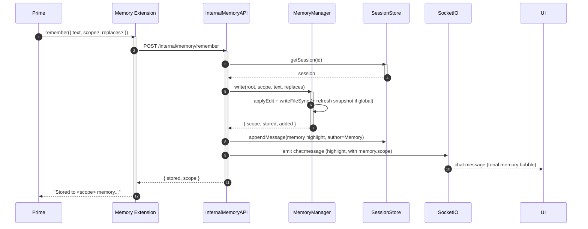

# Memory

[< Back to index](./index.md)

Agents have two memory stores, both owned by the
[`MemoryManager`](../../server/src/pi/memory.ts) and exposed through the
[memory extension](../../server/src/pi/extensions/memory.ts) and the
[internal memory API](../../server/src/routes/internalMemory.ts):

- **Global memory** — long-lived facts that apply across every session. Lives at
  `GLOBAL_MEMORY_DIR/GLOBAL_MEMORY.md`. Only mutated on an explicit user request
  (or after the user confirms a suggestion).
- **Session memory** — facts scoped to one session. Lives at the session root as
  `MEMORY.md`. Created lazily on Prime's first `remember`.

A defining principle: **the server is the sole writer.** The agent's memory tools
only *request* writes; the server performs the file edit and surfaces the
"remembered" highlight from the actual change, so the UI shows ground truth
rather than the agent's narration (keeping the agent honest).

---

## The two files + the snapshot

- `globalFile()` = `GLOBAL_MEMORY_DIR/GLOBAL_MEMORY.md`.
- `sessionFile(root)` = `<root>/MEMORY.md`.
- `sessionGlobalSnapshot(root)` = `<root>/GLOBAL_MEMORY.md` — a read-only copy of
  global memory placed in the session root so the agent can read it with its own
  file tools.

`initSession(root)` (called before the first spawn in `pi.ensure`) ensures the
global file exists and copies the snapshot into the session root. The session
memory file is intentionally **not** created here — Prime creates it on its first
`remember`.

`applyEdit(current, text, replaces?)` appends `text` as a new block, or — when
`replaces` matches a substring — swaps it in place, keeping a single trailing
newline.

---

## The injected preamble

Every agent's appended system prompt is joined with a `## Memory` preamble built
by `buildPreamble(root)` (via `appendWithMemory` in
[piAgentManager.ts](../../server/src/pi/piAgentManager.ts)). It embeds the
current global and session memory text inline so memory is authoritative standing
context from the very first turn, and reminds the agent to modify it only via the
memory tools. Because the preamble is built at spawn time, each new process
(including each sub-agent) starts aware of the latest memory.

---

## Tools by role

From the [memory extension](../../server/src/pi/extensions/memory.ts), gated by
`TANGENT_AGENT_ROLE`:

- **All agents:** `read_memory` — returns the current session + global text
  (`GET /internal/memory/read`). Sub-agents that spot something worth remembering
  must mention it in their reply and let Prime decide (per
  [systemPrompt.md](../../server/src/pi/systemPrompt.md)).
- **Prime only:** `remember` (write directly) and `suggest_memory` (propose a
  change the user must confirm). Prime owns the human conversation, so it is the
  sole writer.

`remember` uses `scope: "session"` by default (or when Prime spots a durable
session improvement) and `scope: "global"` ONLY on an explicit user request.
Anything Prime thinks is worth keeping but the user didn't ask to store —
especially global facts — goes through `suggest_memory` instead.

---

## Sequence: direct write (`remember`)



The highlight card the user sees is built from `result.added` (the exact stored
fragment), not from anything the agent claimed.

---

## Sequence: suggestion -> confirm -> write

`suggest_memory` writes nothing; it records a `PendingSuggestion` and emits a
card. Only the user's confirmation applies it.

```mermaid
sequenceDiagram
  autonumber
  participant Prime
  participant Ext as Memory Extension
  participant Internal as InternalMemoryAPI
  participant Memory as MemoryManager
  participant Socket as SocketIO
  participant UI
  participant Handlers as ChatHandlers
  participant PiManager

  Prime->>Ext: suggest_memory({ text, scope? })
  activate Ext
  Ext->>Internal: POST /internal/memory/suggest
  activate Internal
  Internal->>Memory: addSuggestion(sessionId, scope, text)
  activate Memory
  Memory-->>Internal: { id }
  deactivate Memory
  Internal->>Socket: emit memory:suggestion { suggestionId, scope, text }
  Socket-->>UI: memory:suggestion (confirm/dismiss card)
  Internal-->>Ext: { ok, suggestionId }
  deactivate Internal
  Ext-->>Prime: "Awaiting confirmation; do not assume remembered."
  deactivate Ext

  UI->>Handlers: memory:confirm { suggestionId }
  activate Handlers
  Handlers->>Memory: takeSuggestion(id)
  activate Memory
  Memory-->>Handlers: pending suggestion
  deactivate Memory
  Handlers->>Memory: write(root, scope, text)
  activate Memory
  Memory-->>Handlers: { scope, added }
  deactivate Memory
  Handlers->>Socket: chat:message (memory highlight)
  Socket-->>UI: chat:message
  Handlers->>PiManager: sendToAgent("prime", "user confirmed...")
  activate PiManager
  PiManager-->>Prime: stdin prompt
  deactivate PiManager
  deactivate Handlers
```

A `memory:dismiss` takes the suggestion and tells Prime the user declined; it
writes nothing. Both confirm and dismiss are handled in
[sockets/chat.ts](../../server/src/sockets/chat.ts) (`handleMemoryConfirm` /
`handleMemoryDismiss`); the pending suggestion is validated against its
`sessionId` before anything is applied.
