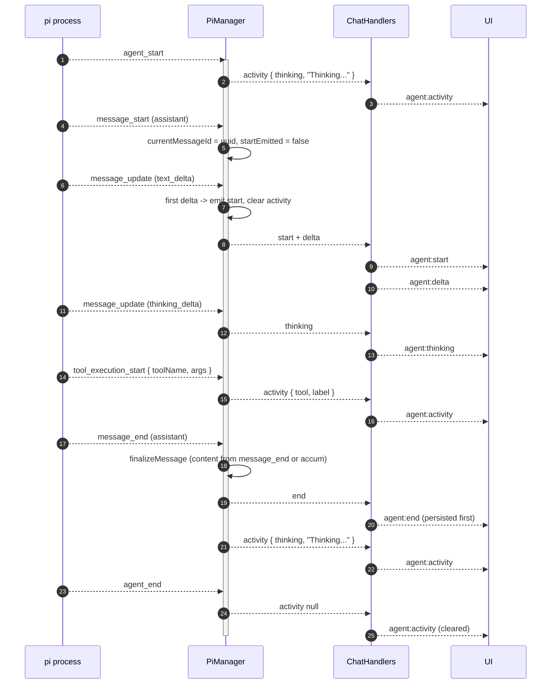
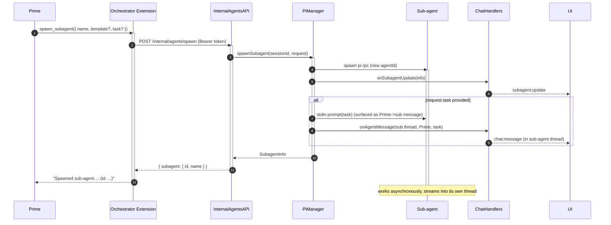

# The Orchestrator

[< Back to index](./index.md)

The [`PiAgentManager`](../../apps/server/src/pi/piAgentManager.ts) is the **local
Pi connector**: it owns the lifecycle of a roster of `pi --mode rpc` child
processes per session, plus the
[orchestrator extension](../../apps/server/src/pi/extensions/orchestrator.ts)
loaded into every `pi` process and the
[internal agents API](../../apps/server/src/routes/internalAgents.ts) the
extension calls back into. It is one of the connectors behind the
[ConnectorRegistry](./connectors.md); message routing across participants is the
[conversation layer](./conversations.md)'s job, not the manager's. The manager's
concern is one transport: spawning Pi children and turning their stdout into
attributed events.

This document explains the manager's state and responsibilities, the spawn
command line, the stdin RPC commands, the stdout event dispatch and streaming
message lifecycle, and the internal callback loop. For how those events reach the
right participants, see [conversations.md](./conversations.md); for the
higher-level choreography between the human, Prime, and sub-agents, see
[human-prime-subagents.md](./human-prime-subagents.md).

---

## What the manager owns

`PiAgentManager` keeps a `Map<sessionId, SessionAgents>`. The shapes
([server/src/pi/types.ts](../../server/src/pi/types.ts)):

- `SessionAgents` = `{ rootPath, agents: Map<agentId, AgentProcess>, config? }`.
  `config` is the `ResolvedSessionConfig` captured from a bundle when the
  session's Prime is first spawned (absent for blank sessions).
- `AgentProcess` is the per-process record: `agentId`, `role`
  (`prime`/`subagent`), `name`, optional `template`, `status`, `createdAt`, the
  Node `child` process, and the streaming bookkeeping fields:
  - `busy` — a run is in flight.
  - `aborted` — the current run was user-aborted (suppresses relay to Prime).
  - `currentMessageId` — the assistant message currently streaming.
  - `startEmitted` — whether `start` was emitted yet (deferred until first delta).
  - `accum` / `thinkingAccum` — accumulated text / reasoning.
  - `lastFinalContent` — the most recent finalized message text.
  - `lastActivity` — the most recent run-level activity (`tool` / `thinking`)
    or `null`; retained in memory so a client joining mid-run can replay it.

The manager is constructed with a shared `ConversationEventSink` (the same sink
every connector uses), the `MemoryManager`, the `RunRegistry`, and the host
resource preamble. The sink's handlers bridge Pi's stream into the conversation
layer rather than emitting to a room directly:

- `onAgentEvent(sessionId, descriptor, event)` — streaming + terminal events; the
  handler routes finalized content through the `ConversationRouter` (which
  persists, broadcasts, and fans out) and streams deltas to the Conversation room.
- `onSubagentUpdate(sessionId, subagent)` — roster changes.
- `onAgentMessage(sessionId, conversationId, author, content)` — a directed
  message surfaced into a specific Conversation via the router.
- `onSessionStatus(...)` — a session's live run-status change for the lobby.

Every stream is attributed to a **Run** (see [connectors.md](./connectors.md)), so
`agent:*` events carry a run id and abort cancels a Run rather than an agent.

---

## Spawning a `pi` process

`spawnAgent` builds the CLI args (`buildPiArgs`), spawns `PI_BIN`, wires the
stdout/stderr readers, and registers the process. The command line:

```
pi --mode rpc --no-session --no-skills
   --provider <PI_PROVIDER> --model <PI_MODEL>
   --tools <comma-joined allowlist>
   --append-system-prompt "<agent prompt>\n\n<memory preamble>"
   --extension <orchestrator.ts>
   --extension <proxyProvider.ts>
   --extension <memory.ts>
   --extension <triggers.ts>
   --extension <session.ts>
   [--skill <dir> ...] [--prompt-template <file> ...] [--extension <tool.ts> ...]
```

- `--mode rpc` runs Pi as a line-delimited JSON RPC server over stdio.
- `--no-session` keeps Pi from persisting its own session state (the server owns
  history).
- `--no-skills` disables Pi's skill auto-discovery so only bundle-provided
  `--skill` paths load (matches the container where `HOME=/tmp`).
- `--tools` is the allowlist; because Pi's allowlist also filters
  extension/custom tools, the orchestration/memory/trigger/session tool names
  must appear here or they would be stripped (see
  [extensions-and-prompts.md](./extensions-and-prompts.md)).
- `--append-system-prompt` is the agent's base prompt joined with the per-session
  memory preamble (`appendWithMemory`).
- The five always-on `--extension` paths come from
  [server/src/pi/utils.ts](../../server/src/pi/utils.ts). Trailing
  `--skill` / `--prompt-template` / `--extension` flags are bundle-supplied
  `SpawnExtras`.

Each child is spawned with `cwd` = the session root and these env vars, which
the extensions read to call back in:

- `TANGENT_SESSION_ID`, `TANGENT_AGENT_ID`, `TANGENT_AGENT_ROLE`
- `TANGENT_INTERNAL_URL`, `TANGENT_INTERNAL_TOKEN`

If `PI_PROXY_API_KEY` / `PI_PROXY_URL` are unset, `warnMissingProxyEnv` logs a
warning once per ensure; the proxy-provider extension still defaults the base URL
to `PI_PROXY_URL`.

---

## The stdin RPC commands

The manager writes newline-delimited JSON commands to a process's stdin:

- **prompt** — `{ id, type: "prompt", message }`. Sent by `sendToAgent`. If the
  target is already `busy`, the command adds `streamingBehavior`, which Pi uses
  to queue the message instead of dropping it. The agent is marked `busy = true`
  immediately. `streamingBehavior` is one of:
  - `"steer"` — a mid-run nudge: Pi applies it after the current tool call
    finishes, **before the next LLM call**. Chosen when the caller passes
    `delivery: "steer"`.
  - `"followUp"` — queued until the run fully stops. The default for the
    `"auto"` and `"followUp"` deliveries, so internal relays never drop a
    message.
- **abort** — `{ id, type: "abort" }`. Sent by `abort` when an agent is busy;
  sets `aborted = true` first. The process stays alive and emits `agent_end`.

`sendToAgent(sessionId, agentId, text, surfaceAuthor?, delivery?)` is the single
entry for delivering text to any agent. `delivery` (`"auto" | "steer" |
"followUp"`, default `"auto"`) only matters while the target is mid-run; when it
is idle a plain `prompt` is sent. When `surfaceAuthor` is provided and the target
is a sub-agent, the text is also surfaced into that sub-agent's transcript (via
`onAgentMessage`) so directed tasks read as a real conversation.

---

## The stdout event dispatch table

`attachJsonlReader` ([utils.ts](../../server/src/pi/utils.ts)) reads the child's
stdout as strict LF-delimited JSONL (deliberately not Node's `readline`, which
also splits on U+2028/U+2029 that are valid inside JSON strings). Each line is
parsed and routed through `eventHandlers`, keyed by the Pi RPC `type`:

| Pi event `type`        | Handler                | Effect                                                                                                     |
| ---------------------- | ---------------------- | ---------------------------------------------------------------------------------------------------------- |
| `agent_start`          | `onAgentStart`         | Reset run state; emit `activity: "Thinking..."`.                                                           |
| `message_start`        | `onMessageStart`       | Open a fresh in-flight assistant message (ignore non-assistant).                                           |
| `message_update`       | `onMessageDelta`       | Accumulate + relay a text/`thinking` delta; lazily emit `start` on the first one.                          |
| `message_end`          | `onMessageEnd`         | Finalize the message into its own bubble; relay sub-agent replies to Prime.                                |
| `tool_execution_start` | `onToolExecutionStart` | Emit a descriptive `tool` activity label.                                                                  |
| `queue_update`         | `onQueueUpdate`        | Relay the pending steer/follow-up queue as a `queue` event (drives the composer's queued-nudge indicator). |
| `agent_end`            | `onAgentEnd`           | Clear `busy` + activity; reset run state.                                                                  |

Unmapped types (`turn_*`, `response`, `extension_ui_request`, etc.) carry no
chat-visible signal and are ignored. Error-shaped lines are always logged;
unparseable lines are logged as errors.

### Streaming message lifecycle

A single run can produce multiple assistant messages. The lifecycle for each:



Notes:

- The activity label for a tool deliberately persists past the tool's
  `tool_execution_end` (which is ignored) until the next message streams in or
  another tool starts, so fast tools stay readable. Labels are produced by
  `toolActivityLabel` with per-tool formatters (e.g. `Reading src/app.ts`,
  `Spawning sub-agent ...`).
- An empty (tool-only) assistant message that never emitted `start` finalizes
  silently.
- `emitActivity` records the value on the producing `AgentProcess`
  (`lastActivity`) in addition to relaying it. This is in-memory only (never
  persisted to disk), but it lets `handleChatJoin` replay the current activity to
  a client that joins mid-run via `listActivities` (see
  [ui-server-protocol.md](./ui-server-protocol.md)), so the indicator and
  activity bubble survive a page reload.

---

## The internal callback loop

The extensions inside each `pi` process are thin HTTP clients. Tool calls become
`POST`/`GET` requests to `/internal/agents/*` (and the memory/triggers/session
internal routers), all bearing the shared `INTERNAL_TOKEN`. The manager is the
single authority that mutates roster state and writes to stdin, so the loop
always passes back through it.



The internal agents API endpoints
([routes/internalAgents.ts](../../server/src/routes/internalAgents.ts)):

| Endpoint                        | Caller (tool)               | Manager method               |
| ------------------------------- | --------------------------- | ---------------------------- |
| `POST /internal/agents/spawn`   | `spawn_subagent` (Prime)    | `spawnSubagent`              |
| `POST /internal/agents/message` | `message_subagent` (Prime)  | `sendToAgent(..., PI_AGENT)` |
| `POST /internal/agents/report`  | `message_prime` (sub-agent) | `reportToPrime`              |
| `POST /internal/agents/kill`    | `kill_subagent` (Prime)     | `killAgent`                  |
| `GET /internal/agents/list`     | `list_subagents` (Prime)    | `listSubagents`              |
| `GET /internal/agents/room`     | `read_room` (all agents)    | `store.getMessages` (sliced) |

The orchestrator extension gates tools by `TANGENT_AGENT_ROLE`: every agent gets
`read_room`; sub-agents additionally get `message_prime`; Prime gets
`spawn_subagent` / `message_subagent` / `kill_subagent` / `list_subagents`.

---

## Lifecycle methods

- `ensure(sessionId, rootPath, config?)` — spawn Prime if not already running.
  Captures a bundle `config` on first creation; later calls without a config
  keep the captured one. Calls `memory.initSession(rootPath)` before the first
  spawn so the preamble reflects current memory.
- `prompt(sessionId, rootPath, text)` — `ensure` then `sendToAgent("prime", ...)`.
  Only Prime receives human input.
- `spawnSubagent(sessionId, request)` — allocate an id, resolve the config
  (`resolveSubagentConfig` with the session's templates/defaults), spawn, emit a
  roster update, and optionally deliver the initial `task`.
- `reportToPrime(sessionId, fromAgentId, text)` — surface a sub-agent's mid-run
  report in its own thread and deliver it to Prime's stdin.
- `abort(sessionId, agentId)` — send the `abort` RPC to a busy agent (sets
  `aborted`).
- `killAgent(sessionId, agentId, completed)` — record `completed`/`killed`
  status, drop from roster, kill the process, emit a roster update. Prime cannot
  be killed.
- `listActivities(sessionId)` — returns each live agent (Prime + sub-agents)
  whose `lastActivity` is non-null, so `handleChatJoin` can replay the current
  activity to a joining client.
- `listSubagents` / `dispose` / `disposeAll`.

### Crash + error handling

`wireChildStreams` attaches `error` and `exit` handlers. Both call:

- `failInFlight` — if a run was in flight, emit an `agent:error` for the
  in-flight message and reset state.
- `removeAgent` — drop the process from the roster; if a sub-agent was still
  `active` (i.e. not intentionally killed), transition it to the terminal status
  (`error`) and emit a roster update.

`relaySubagentReply` (called from `finalizeMessage`) is what keeps Prime in the
loop: each finalized sub-agent message is fed back to Prime as it lands — not
just once at run end — so intermediate reports (e.g. a submitted run id) are not
dropped. A user-aborted run skips this relay.
