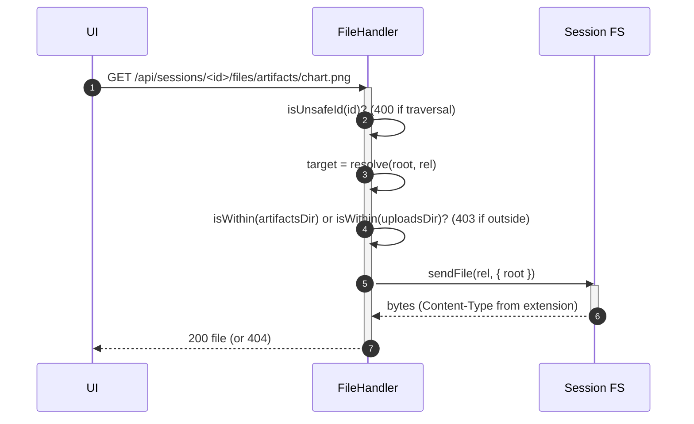

# Sessions and Storage

[< Back to index](./index.md)

A **session** is the unit of work: a chat thread, a scoped workspace folder on
disk, a roster of `pi` processes, plus its triggers, memory, and pinned
artifacts. This doc covers the session model, the `SessionStore` abstraction, the
per-session root folder layout, and the path-traversal-guarded file server for
artifacts and uploads.

---

## The session model

The wire `Session` ([shared/contracts.ts](../../shared/contracts.ts)):
`id`, `name`, `rootPath` (absolute path to the scoped folder), `status`
(`"created"`), optional `config` (`SessionConfigMeta` when created from a
bundle), and `createdAt`/`updatedAt`. Chat history is a list of `ChatMessage`,
each tagged with a `conversationId` (`"prime"` or a sub-agent id) so the client
buckets it into the right transcript.

---

## The `SessionStore` abstraction

[store/sessionStore.ts](../../server/src/store/sessionStore.ts) is the storage
interface; the routes and socket handlers depend only on it, so a persistent
backend (DB, file) can be swapped in later without touching them. Today the only
implementation is
[`InMemorySessionStore`](../../server/src/store/inMemorySessionStore.ts), which
keeps three maps: sessions, messages (by session), and pinned artifacts (by
session).

Methods: `listSessions`, `getSession`, `createSession`, `updateSession`,
`attachConfig`, `deleteSession`, `getMessages`, `appendMessage`, `getArtifacts`,
`pinArtifact`, `unpinArtifact`.

`createSession` allocates a `randomUUID()`, derives `rootPath =
SESSIONS_ROOT/<id>`, creates that folder plus its `artifacts/` subfolder, and
names the session `Session <n>` when no name is given.

> **Persistence caveat.** Sessions, chat history, and pinned-artifact lists are
> in-memory and lost on restart. The on-disk side effects (the root folder,
> triggers, memory files, installed bundle tree, artifacts, uploads) survive, so
> a restarted server can re-arm triggers and re-serve files but cannot replay
> chat history for a session whose in-memory record is gone.

`pinArtifact` dedupes by `path` (re-pinning refreshes the title in place,
preserving order; a new path appends), so the list reads oldest-first.

---

## The per-session root folder

Each session owns `SESSIONS_ROOT/<id>/`. After a bundle install and some agent
activity it looks like:

```
.sessions/<id>/
  artifacts/            # user-facing files agents write (served over HTTP)
  uploads/              # human chat attachments (served over HTTP)
  MEMORY.md             # session memory (created on Prime's first remember)
  GLOBAL_MEMORY.md      # read-only snapshot of global memory
  AGENTS.md             # bundle rules file (Pi auto-discovers from cwd)
  <context/memory files># flattened bundle seed files
  .tangent/             # installed bundle tree (out of the agent's way)
    tangent.yaml
    prompts/ skills/ workflows/ agents/ tools/ ui/
    triggers/<name>.js  # compiled trigger handlers
    triggers.json       # persisted trigger definitions
```

Every `pi` process for the session runs with `cwd` set to this root, and the
agents' tools are scoped to it (the prompts instruct them to treat the working
directory as the entire world). The `.tangent/` subtree keeps bundle internals
beside the session but out of the agent's primary view, while rules + seed memory
are copied to the root precisely because Pi auto-discovers `AGENTS.md` and memory
from `cwd`.

---

## Uploads

`POST /api/sessions/:id/files` ([routes/sessions.ts](../../server/src/routes/sessions.ts))
streams chat attachments straight to `<root>/uploads/` via `multer` disk storage
(10 MB limit). The destination is derived from the `:id` route param, which is
validated for traversal (`isUnsafeId`) before multer runs; stored filenames are
prefixed with random bytes so same-named uploads never collide, while the
original name is preserved in the returned `Attachment` metadata. When a message
carries attachments, the chat handler appends their workspace-relative paths to
the prompt so the agent knows to read them with its own file tools
(`promptWithAttachments`).

---

## Serving artifacts + uploads

`GET /api/sessions/:id/files/*splat` serves files from the session root, but only
from the `artifacts/` or `uploads/` subtrees. This is how images render inline
and HTML artifacts (plus their relative assets) resolve in the chat UI.



The handler keys off the deterministic `SESSIONS_ROOT/<id>` path rather than the
in-memory session record, so artifacts stay servable across server restarts even
though the session record itself is volatile. `path.resolve` + the `isWithin`
checks prevent escaping the allowed subtrees.

---

## Pinned artifacts

An agent (via the `pin_artifact` tool) or the user (via the `artifact:pin` socket
event) can pin an artifact for quick access. Both paths call
`store.pinArtifact` and broadcast an `artifacts.update` `ui:command` to the room;
the join handler also sends the current list to a newly joined socket. The wire
shape `PinnedArtifact` is `{ path, title, pinnedAt }`, identified by its
workspace-relative `path` so the client resolves it through the same `/files/`
API as inline artifact chips. See
[ui-server-protocol.md](./ui-server-protocol.md) for the `ui:command` channel.
