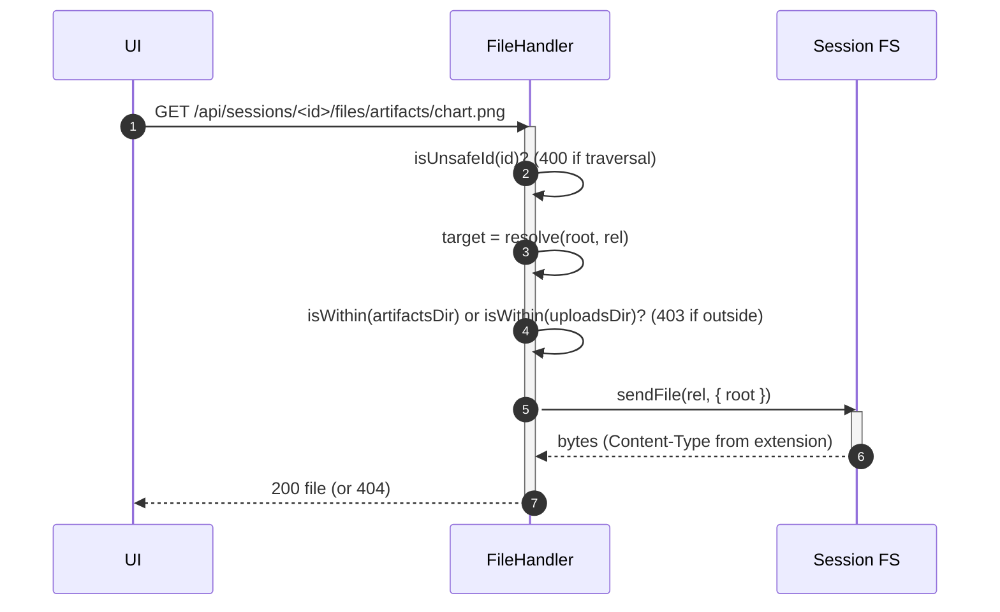

# Sessions and Storage

[< Back to index](./index.md)

A **session** is the unit of work: its Conversations, a scoped workspace folder
on disk, its Participants and connectors, plus its triggers, memory, and
Resources. This doc covers the session model, the `SessionStore` abstraction, the
SQLite schema, the per-session root folder layout, and the path-traversal-guarded
file server for artifacts and uploads.

---

## The session model

The wire `Session` ([packages/shared/src/contracts.ts](../../packages/shared/src/contracts.ts)):
`id`, `name`, `rootPath` (absolute path to the scoped folder), `status`
(`"created"`), optional `config` (`SessionConfigMeta` when created from a
bundle), and `createdAt`/`updatedAt`. Each chat message is a `ChatMessage` tagged
with a `conversationId` — now a **Conversation id** (a fresh uuid, or a legacy
agent id whose transcript the `conversations` table maps), not necessarily an
agent id — so the client buckets it into the right transcript.

---

## The `SessionStore` abstraction

[store/sessionStore.ts](../../apps/server/src/store/sessionStore.ts) is the storage
interface; the routes and socket handlers depend only on it. The production
implementation is
[`SqliteSessionStore`](../../apps/server/src/store/sqliteSessionStore.ts), backed by
the shared `tangent.db` connection (`openDb()` applies pending drizzle migrations
on startup). It composes the participant and resource stores so a roster write
mirrors into the `participants` table and a pinned artifact into the resource
catalog. `InMemorySessionStore` still exists but is a test fake, not the
production backend.

`createSession` allocates a `randomUUID()`, derives `rootPath =
SESSIONS_ROOT/<id>`, creates that folder plus its `artifacts/` subfolder, and
names the session `Session <n>` when no name is given. `pinArtifact` dedupes by
`path` (re-pinning refreshes the title in place, preserving order; a new path
appends), so the list reads oldest-first.

> **Durability.** Sessions, the agent roster, participants, memberships, runs,
> and the resource catalog are persisted in `tangent.db`; chat transcripts are
> append-only JSONL under each session's `.tangent/chats/`. Both survive a
> restart. Transcript files are **never rewritten in place** — a new `ChatMessage`
> field is defaulted on read in
> [chatLog.ts](../../apps/server/src/store/chatLog.ts) so a legacy line still
> parses.

---

## The SQLite schema

The relational state lives in [db/schema.ts](../../apps/server/src/store/db/schema.ts).
Chat history is deliberately **not** a table — it stays as JSONL on disk. Schema
changes go exclusively through drizzle migrations; never alter tables ad-hoc.

| Table                 | Holds                                                                                          |
| --------------------- | --------------------------------------------------------------------------------------------- |
| `sessions`            | one row per session (mirrors the `Session` wire contract, plus `archived`, `user_identity`).  |
| `session_assets`      | pinned artifacts, scoped to a session, oldest-first.                                           |
| `session_agents`      | the agent roster (Prime + sub-agents) with connector facets; still the write authority today. |
| `participants`        | session-scoped actor identities (`human` / `agent` / `automation`), capabilities, presence.   |
| `conversations`       | per-Conversation `seq` counter and its owning agent; maps a Conversation id to its transcript.|
| `memberships`         | a `(participant, conversation)` attachment: reaction spec, ingress, transcript visibility.     |
| `runs`                | one unit of work by one participant: status, ingress, home conversation, external id, cursor.  |
| `resources`           | the catalog: `file` / `memory` / `attachment` / `artifact`, pointing at bytes by `uri`.       |
| `resource_references` | a resource surfaced into a Conversation (surfacing + citation, not a filesystem gate).         |
| `resource_grants`     | per-Membership refinement of a reference; default-permissive (an empty table changes nothing). |
| `session_views`       | when each user last opened a session.                                                          |

`session_agents` remains the write authority for the roster; `participants` is
mirrored from it (and derived read-through for a session the backfill never
touched). The deprecated `host` column survives beside the connector facets. A
later cleanup folds these away.

---

## The per-session root folder

Each session owns `SESSIONS_ROOT/<id>/`. After a bundle install and some agent
activity it looks like:

```
.sessions/<id>/
  artifacts/            # user-facing files agents write (served over HTTP)
  uploads/              # human chat attachments (served over HTTP)
  MEMORY.md             # session memory (created on Prime's first remember)
  GLOBAL_MEMORY.md      # read-only snapshot of global memory
  AGENTS.md             # bundle rules file (Pi auto-discovers from cwd)
  <context/memory files># flattened bundle seed files
  .tangent/             # installed bundle tree (out of the agent's way)
    tangent.yaml
    prompts/ skills/ workflows/ agents/ tools/ ui/
    triggers/<name>.js  # compiled trigger handlers
    triggers.json       # persisted trigger definitions
    chats/<conversationId>.jsonl  # append-only transcripts, one per Conversation
```

Every `pi` process for the session runs with `cwd` set to this root, and the
agents' tools are scoped to it (the prompts instruct them to treat the working
directory as the entire world). The `.tangent/` subtree keeps bundle internals
beside the session but out of the agent's primary view, while rules + seed memory
are copied to the root precisely because Pi auto-discovers `AGENTS.md` and memory
from `cwd`.

---

## Uploads

`POST /api/sessions/:id/files` ([routes/sessions.ts](../../server/src/routes/sessions.ts))
streams chat attachments straight to `<root>/uploads/` via `multer` disk storage
(10 MB limit). The destination is derived from the `:id` route param, which is
validated for traversal (`isUnsafeId`) before multer runs; stored filenames are
prefixed with random bytes so same-named uploads never collide, while the
original name is preserved in the returned `Attachment` metadata. When a message
carries attachments, the chat handler appends their workspace-relative paths to
the prompt so the agent knows to read them with its own file tools
(`promptWithAttachments`).

---

## Serving artifacts + uploads

`GET /api/sessions/:id/files/*splat` serves files from the session root, but only
from the `artifacts/` or `uploads/` subtrees. This is how images render inline
and HTML artifacts (plus their relative assets) resolve in the chat UI.



The handler keys off the deterministic `SESSIONS_ROOT/<id>` path, so artifacts
stay servable regardless of connector state. `path.resolve` + the `isWithin`
checks prevent escaping the allowed subtrees.

---

## Pinned artifacts

An agent (via the `pin_artifact` tool) or the user (via the `artifact:pin` socket
event) can pin an artifact for quick access. Both paths call
`store.pinArtifact` and broadcast an `artifacts.update` `ui:command` to the room;
the join handler also sends the current list to a newly joined socket. The wire
shape `PinnedArtifact` is `{ path, title, pinnedAt }`, identified by its
workspace-relative `path` so the client resolves it through the same `/files/`
API as inline artifact chips. See
[ui-server-protocol.md](./ui-server-protocol.md) for the `ui:command` channel.
