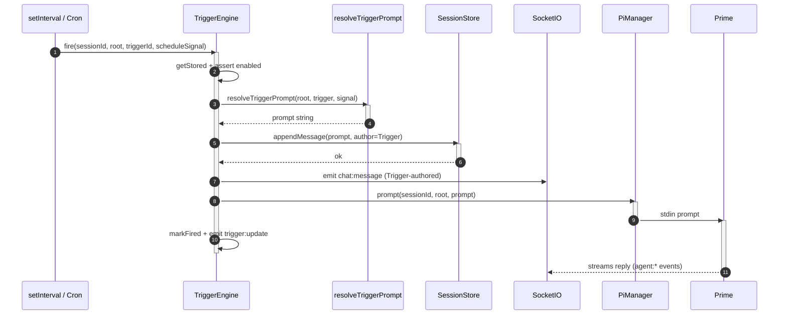
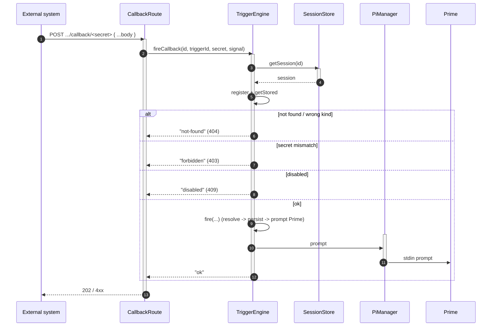

# Triggers

[< Back to index](./index.md)

A **trigger** turns an external signal into a prompt delivered to its **target**,
exactly as if a directed message had arrived. There are two kinds:

- **schedule** — fires on a timer (`schedule.every` like `"1h"`/`"30m"`/`"45s"`,
  or a `schedule.cron` expression).
- **callback** — exposes a secret-guarded inbound URL an external system can
  `POST` to.

Each trigger also has a **target** that decides who reacts to a firing:

- **subagent** (default) — the trigger owns a dedicated sub-agent. Its revival
  spec (name/template/system prompt/tools/model/thinking) is persisted with the
  trigger, so the sub-agent can be re-spawned from scratch if it dies or after a
  restart. The sub-agent reacts in **isolation**: its replies are not
  auto-relayed back to Prime, though it can still reach Prime on its own via
  `message_prime`.
- **prime** (discouraged) — firings are delivered to the session's Prime agent,
  the legacy behavior. Kept for compatibility but discouraged so trigger work
  doesn't interrupt the human conversation.

Triggers persisted before targets existed (and bundle-declared triggers) default
to the `prime` target.

The subsystem has four parts:

- [`TriggerManager`](../../server/src/pi/triggers/triggerManager.ts) — owns the
  per-session definitions and their on-disk persistence.
- [`TriggerEngine`](../../server/src/pi/triggers/triggerEngine.ts) — arms
  schedule timers at runtime and delivers firings to each trigger's target.
- [`handlerRunner`](../../server/src/pi/triggers/handlerRunner.ts) +
  [`promptTemplate`](../../server/src/pi/triggers/promptTemplate.ts) — resolve a
  signal into the prompt text.
- Prime's [triggers extension](../../server/src/pi/extensions/triggers.ts) and
  the REST/internal routes — let Prime or the UI manage triggers.

---

## Definitions + persistence (`TriggerManager`)

Triggers persist on disk under each session's `.tangent/triggers.json`, so they
survive a server restart even though the session list is in-memory. The manager
is the single writer; the scheduler, callback route, REST routes, and Prime's
tool all go through it.

- `StoredTrigger` mirrors the wire `Trigger` but keeps server-only fields: the
  callback `secret` (embedded in the URL, never surfaced as a field) and
  `handlerPath` (compiled transform location relative to the session root).
- `target` records where firings go. For a `subagent` target it holds the
  revival `spec` plus the currently-live `agentId`/`agentName`; `setTargetAgent`
  rewrites the live id whenever the engine (re)spawns the sub-agent.
- `register(sessionId, rootPath)` lazily loads the file into memory (idempotent;
  safe to call on every `pi.ensure`).
- `seedFromBundle` writes a bundle's declared triggers at session creation
  (each gets a fresh id + callback secret; `source: "bundle"`).
- `create` adds a runtime trigger (`source: "runtime"`, prompt-template only —
  runtime triggers can't embed a handler), validating the slug name, uniqueness,
  required `prompt`, and that schedule triggers carry a schedule. It builds the
  `target` from the request (defaulting to a `subagent` target whose name falls
  back to the trigger's title/name).
- `update` / `remove` / `markFired` mutate and re-persist.
- `toContract` projects to the wire shape, hiding the secret/handler path and
  building the public `callbackPath` for callback triggers.

---

## Arming + firing (`TriggerEngine`)

One `TriggerEngine` is shared across sessions; it tracks per-session schedule
handles in `timers` while definitions live in the `TriggerManager`.

- `seed` (at install) and `sync` (on chat join) both `register` + `arm`.
- `arm` clears existing handles then arms every **enabled schedule** trigger:
  a `cron` string -> a `croner` `Cron`; otherwise `parseEvery` converts
  `"1h"`/`"30m"`/`"45s"`/`"2d"` to ms and uses `setInterval` (floored at
  `MIN_INTERVAL_MS` = 1000 so a bad `every` can't busy-loop the server).
- `afterChange` re-arms and broadcasts `trigger:roster` to the room.
- `provision` (called right after `create`) eagerly spawns a `subagent`-target
  trigger's dedicated sub-agent so it exists before the first firing.
- `dispose` / `disarm` tear down timers.

`fire` resolves the prompt then dispatches on the target:

- **subagent** — `deliverToSubagent` calls `ensureSubagent`, which reuses the
  recorded sub-agent when it's still live (`pi.hasAgent`) or re-spawns it from
  the stored spec (with `autoRelayToPrime: false`), persisting the new id via
  `setTargetAgent` + `store.recordAgent`. The prompt is then surfaced in the
  sub-agent's own thread and delivered to it.
- **prime** — `deliverToPrime` keeps the legacy path: surface in Prime's thread
  and `pi.prompt` (spawning Prime if needed).

### Schedule firing

The firing is surfaced in the transcript attributed to the `TRIGGER_AUTHOR`
(named after the trigger's title), then delivered to the trigger's target. The
diagram above shows the `prime` target; a `subagent` target instead revives (if
needed) and prompts the trigger's dedicated sub-agent, which reacts in isolation.

### Inbound callback

`POST /api/sessions/:id/triggers/:triggerId/callback/:secret`
([routes/sessions.ts](../../server/src/routes/sessions.ts)) is public but
secret-guarded. It accepts JSON or `application/x-www-form-urlencoded` and the
body becomes the signal payload.

---

## Signal -> prompt resolution

`resolveTriggerPrompt(root, trigger, signal)`
([handlerRunner.ts](../../server/src/pi/triggers/handlerRunner.ts)) prefers a
compiled handler when present, else renders the prompt template:

- **Compiled handler** — if `trigger.handlerPath` exists on disk, run it in an
  isolated worker thread (`runTriggerHandler`). The worker gets an empty env (no
  server secrets), a memory ceiling (`maxOldGenerationSizeMb: 64`), and a
  wall-clock timeout (`DEFAULT_TIMEOUT_MS` = 5000) enforced by terminating the
  thread, so a hung or runaway transform can't stall the server. The handler
  default-exports a function `(signal) => string | { prompt: string }`; the
  result is coerced to a non-empty string and capped at `MAX_PROMPT_LENGTH`
  (16000). The worker is for fault isolation + a hard timeout, **not** a security
  boundary against deliberately malicious code (the handler is trusted
  bundle-author code, same trust model as Pi tool extensions).
- **Prompt template** — `renderPrompt(template, signal)`
  ([promptTemplate.ts](../../server/src/pi/triggers/promptTemplate.ts))
  interpolates `{{dotted.path}}` placeholders against the signal. Missing paths
  render empty; non-string values are JSON-encoded so structured payloads stay
  legible (e.g. `{{body.runId}}`).

---

## Management surfaces

Triggers can be managed three ways, all funneling through the `TriggerManager` +
`TriggerEngine.afterChange`:

- **Prime's tools** — the [triggers extension](../../server/src/pi/extensions/triggers.ts)
  registers Prime-only `create_trigger` / `list_triggers` / `enable_trigger` /
  `disable_trigger` / `delete_trigger`, which call
  [internal/triggers](../../server/src/routes/internalTriggers.ts) (target a
  trigger by name or id). `create_trigger` takes a `target` (`subagent` default,
  `prime` discouraged) and an optional `subagent` spec for the dedicated agent.
- **REST** — the session router's `/:id/triggers` endpoints for the UI.
- **Bundle** — declared triggers seeded at install (`seedFromBundle`).

After any create/update/delete, `afterChange` re-arms schedules and broadcasts
`trigger:roster` so connected clients refresh.
