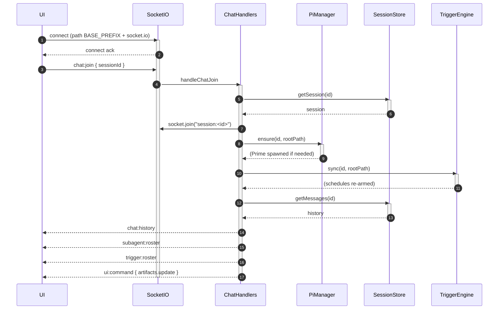
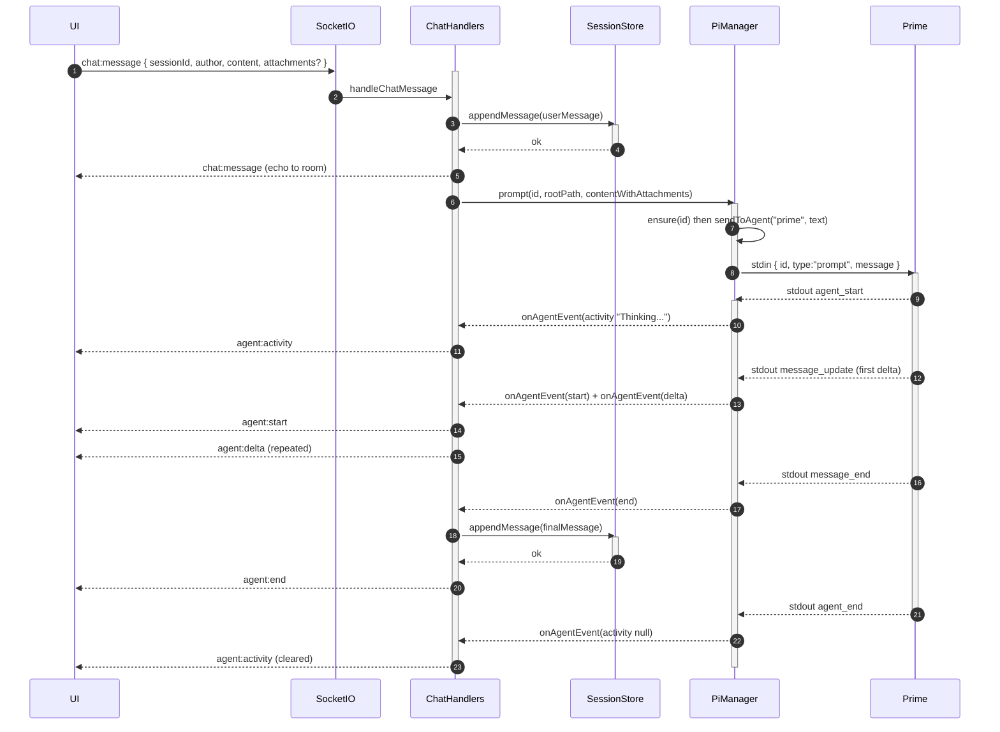
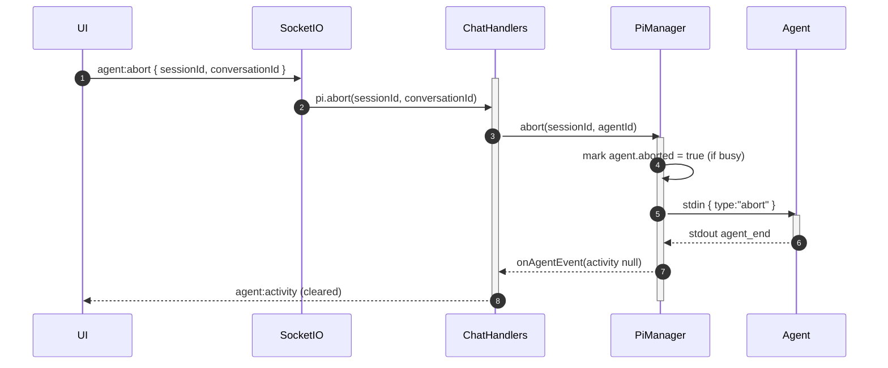
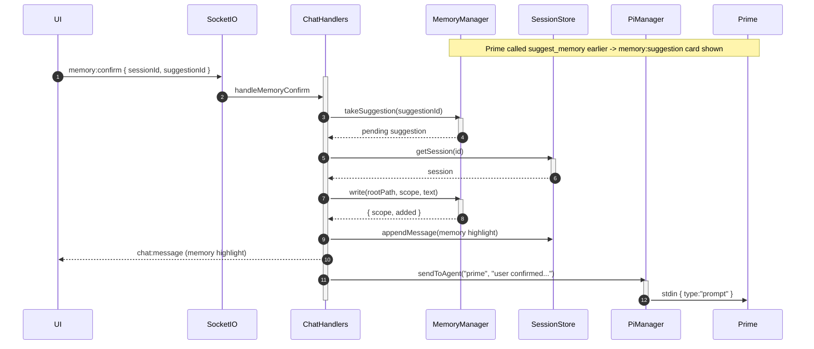
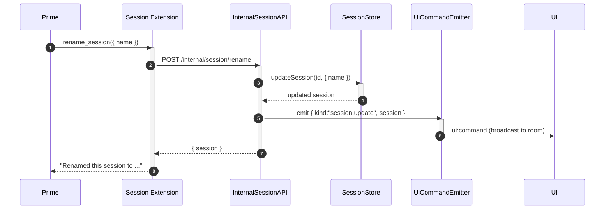

# UI <-> Server Protocol

[< Back to index](./index.md)

The web UI talks to the server over **two transports**:

- **REST (`/api/*`)** — request/response CRUD for sessions, agent bundles,
  triggers, file uploads, and serving artifact/upload files.
- **Socket.IO** — the live, bidirectional chat/stream protocol. The client joins
  one room per session (`session:<id>`) and receives all streaming agent output,
  roster changes, memory cards, trigger roster, and generic UI directives there.

The wire shapes for both are defined once in
[packages/shared/src/contracts.ts](../../packages/shared/src/contracts.ts) and
imported by both `apps/server` and `apps/web` from the `@tangent/shared`
workspace package, so the two sides never drift. The client side of the socket
protocol lives in
[apps/web/src/features/chat/hooks/useSessionChat.ts](../../apps/web/src/features/chat/hooks/useSessionChat.ts).

---

## REST surface

Routers are created in [server/src/index.ts](../../server/src/index.ts) and
implemented under [server/src/routes/](../../server/src/routes).

### Sessions — [routes/sessions.ts](../../server/src/routes/sessions.ts)

| Method + path                                                 | Purpose                                                                                                        |
| ------------------------------------------------------------- | -------------------------------------------------------------------------------------------------------------- |
| `GET /api/sessions`                                           | List sessions (sorted by `createdAt`).                                                                         |
| `POST /api/sessions`                                          | Create a session. Plain JSON, or a multipart `config` ZIP, or `{ bundleId }` referencing a marketplace bundle. |
| `GET /api/sessions/:id`                                       | Fetch one session.                                                                                             |
| `PATCH /api/sessions/:id`                                     | Rename a session.                                                                                              |
| `DELETE /api/sessions/:id`                                    | Delete a session; disposes its `pi` processes and triggers.                                                    |
| `POST /api/sessions/:id/files`                                | Upload chat attachments into the session's `uploads/`.                                                         |
| `GET /api/sessions/:id/triggers`                              | List the session's triggers.                                                                                   |
| `POST /api/sessions/:id/triggers`                             | Create a runtime trigger.                                                                                      |
| `PATCH /api/sessions/:id/triggers/:triggerId`                 | Update a mutable trigger field.                                                                                |
| `DELETE /api/sessions/:id/triggers/:triggerId`                | Delete a trigger.                                                                                              |
| `POST /api/sessions/:id/triggers/:triggerId/callback/:secret` | Public, secret-guarded inbound callback that fires a callback trigger.                                         |
| `GET /api/sessions/:id/files/*splat`                          | Serve a file from the session's `artifacts/` or `uploads/` subtree (path-traversal guarded).                   |

### Agent bundles — [routes/agentBundles.ts](../../server/src/routes/agentBundles.ts)

| Method + path                         | Purpose                                                      |
| ------------------------------------- | ------------------------------------------------------------ |
| `GET /api/agent-bundles`              | List saved bundle metadata.                                  |
| `POST /api/agent-bundles`             | Upload + validate + store a bundle ZIP (multipart `bundle`). |
| `GET /api/agent-bundles/:id`          | Fetch one bundle's metadata.                                 |
| `GET /api/agent-bundles/:id/icon`     | Serve the preview SVG.                                       |
| `GET /api/agent-bundles/:id/download` | Download the original ZIP.                                   |
| `GET /api/agent-bundles/:id/ui/:file` | Serve a compiled UI component JS asset.                      |
| `POST /api/agent-bundles/ui-egress`   | The bundle-UI `host.fetch` egress proxy.                     |
| `DELETE /api/agent-bundles/:id`       | Delete a saved bundle.                                       |

`GET /api/health` returns `{ ok: true }`.

---

## Socket.IO event catalog

Event names come from `SocketEvents` in
[shared/contracts.ts](../../shared/contracts.ts).

### Client -> Server

- `chat:join` `{ sessionId }` — join the session room.
- `chat:message` `{ sessionId, author, content, conversationId?, delivery?, attachments? }` —
  post a human message. `conversationId` targets the thread (`"prime"` by
  default, or a sub-agent id so users can steer it from its own tab).
  `delivery` (`"auto" | "steer" | "followUp"`, default `"auto"`) controls how a
  message is queued when the target agent is mid-run: `"steer"` nudges it before
  the next LLM call, `"followUp"` waits until the run stops; both are ignored
  when the agent is idle.
- `agent:abort` `{ sessionId, conversationId }` — abort an agent's in-progress
  run (`conversationId` is `"prime"` or a sub-agent id).
- `memory:confirm` `{ sessionId, suggestionId }` — accept a memory suggestion.
- `memory:dismiss` `{ sessionId, suggestionId }` — decline a memory suggestion.
- `artifact:pin` `{ sessionId, path, title }` — pin an artifact.
- `artifact:unpin` `{ sessionId, path }` — unpin an artifact.
- `terminal:data` — reserved/no-op stub for a future phase.

### Server -> Client

- `chat:history` `ChatMessage[]` — full transcript, sent on join.
- `chat:message` `ChatMessage` — a persisted message (human, directed sub-agent
  task, sub-agent report, memory highlight, or trigger prompt).
- `agent:start` `{ message }` — an agent opened a new (empty) reply bubble.
- `agent:delta` `{ sessionId, messageId, delta }` — a streamed text chunk.
- `agent:thinking` `{ sessionId, messageId, delta }` — a streamed reasoning chunk.
- `agent:end` `{ message }` — the finalized message (persisted first).
- `agent:error` `{ sessionId, messageId?, message }` — a run failed.
- `agent:activity` `{ sessionId, conversationId, activity }` — ephemeral
  spinner state (`thinking` / `tool` / `null`); never persisted.
- `agent:queue` `{ sessionId, conversationId, steering, followUp }` — the
  agent's pending steer/follow-up nudges changed; drives the composer's
  queued-nudge indicator. Empty arrays mean the queue drained.
- `subagent:roster` `{ sessionId, subagents }` — full roster on join.
- `subagent:update` `{ sessionId, subagent }` — one sub-agent's spawn/status
  change (upserted by id).
- `memory:suggestion` `{ sessionId, suggestionId, scope, text }` — a
  confirm/dismiss card.
- `trigger:roster` `{ sessionId, triggers }` — full trigger roster on join.
- `trigger:update` `{ sessionId, trigger }` — one trigger's create/update.
- `trigger:removed` `{ sessionId, triggerId }` — a trigger was deleted.
- `ui:command` `{ sessionId, command }` — the generic agent->UI directive
  channel (`session.update`, `artifacts.update`).

Each message carries a `conversationId` that tells the client which transcript
to bucket it into: `"prime"` for the main human/Prime thread, or a sub-agent id
for that sub-agent's drill-in thread. The author's `agentRole` (`prime` vs
`subagent`) drives rendering differences.

---

## Sequence: connect + join + replay

When a session view mounts, `useSessionChat` opens a socket and emits
`chat:join`; the server replays everything the client needs to render the room.

Note: the artifact list is sent to _only the joining socket_ using the same
`artifacts.update` directive that later broadcasts mutations to the whole room.

---

## Sequence: send a message + streamed reply

This is the central protocol. The human's message is persisted and broadcast,
then relayed into Prime's stdin; Prime's reply streams back as `agent:*` events.

Key correctness details (see [orchestrator.md](./orchestrator.md) for the full
event lifecycle):

- The `agent:start` is deferred until the **first** text/thinking delta, so a
  tool-only assistant message never opens an empty bubble.
- `agent:end` is persisted **before** it is broadcast, so a client that
  reconnects mid-stream still sees the message in `chat:history`.
- `thinking` deltas stream for every agent; the final `agent:end` carries the
  authoritative content (from the `message_end` payload, not just the streamed
  accumulator).

---

## Sequence: abort a run

The process stays alive; the `aborted` flag ensures a half-finished sub-agent
reply is not relayed back to Prime as if it had completed.

---

## Sequence: memory suggestion confirm / dismiss

When Prime proposes a memory it isn't allowed to write directly, the server
emits a card. The user's choice is sent back over the socket.

A `memory:dismiss` follows the same shape but writes nothing; it only tells
Prime the user declined so it can continue honestly. See
[memory.md](./memory.md).

---

## Sequence: the generic `ui:command` channel

`ui:command` is the single, extensible transport every agent->UI directive rides
on. Today it carries `session.update` (after `rename_session`) and
`artifacts.update` (pin/unpin). Clients dispatch by `command.kind` and ignore
kinds they don't recognize, so older clients stay forward-compatible.

Artifact pinning works the same way: it can originate from the UI
(`artifact:pin` socket event) or from an agent (the `pin_artifact` tool via
`POST /internal/session/pin-artifact`), and both paths broadcast an
`artifacts.update` `ui:command` to the room.
