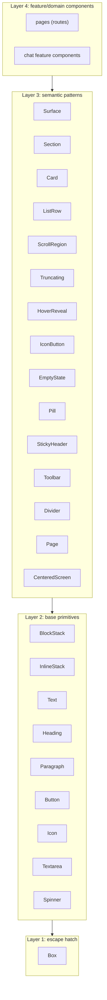

# Design System

Adopted from the sister project (TangleML/tangle-ui). The single rule for feature code:

> **Do not pass `className` to a Tangle UI primitive.** Use a semantic prop or a layer-3 pattern.

This is enforced by the `tangle-ui/no-classname-on-primitives` ESLint rule
([eslint-rules/no-classname-on-primitives.js](../../../eslint-rules/no-classname-on-primitives.js)),
which runs as `error` on `src/features/**` and `src/routes/**`.

## The four layers

| Layer                   | Where                                  | Use it when                                                   |
| ----------------------- | -------------------------------------- | ------------------------------------------------------------ |
| 4 — feature/domain      | `src/features/*`, `src/routes/*`       | The component encodes app behavior specific to a screen.     |
| 3 — semantic patterns   | `@/shared/ui/patterns/*`               | An intent is named (a panel, a scroll region, a row, ...).   |
| 2 — base primitives     | `@/shared/ui/{layout,typography,...}`  | You need raw layout, text, or interactive controls.          |
| 1 — `Box`               | `@/shared/ui/box`                      | Nothing higher fits and you need a styled container.         |

Code is expected to live in the upper layers. Reaching for a lower one is a smell.

## Intent catalog

| Layer-3 primitive                            | Replaces className signature                                                    |
| -------------------------------------------- | ------------------------------------------------------------------------------ |
| `<Surface>` / `<Section>` / `<Card>`         | `bg-* rounded-* border-* p-*` panels                                            |
| `<ScrollRegion axis="y">`                    | `flex-1 min-h-0 overflow-y-auto`                                               |
| `<Truncating>`                               | `min-w-0 flex-1` around a shrinkable cell                                       |
| `<ListRow hoverable onClick>`                | `<InlineStack className="group hover:bg-* px-* py-*">` rows                     |
| `<HoverReveal>`                              | `opacity-0 group-hover:opacity-100 focus-within:opacity-100 transition-opacity` |
| `<Toolbar density chrome sticky>`            | `InlineStack gap-1 shrink-0 px-* py-*` action bars                              |
| `<EmptyState icon title description action>` | centered `flex items-center justify-center text-center p-*` placeholders        |
| `<StickyHeader>`                             | `sticky top-0 z-* bg-*` inside a `ScrollRegion`                                 |
| `<IconButton icon size variant tone>`        | `<Button h-5 w-5 p-0><Icon /></Button>`                                         |
| `<Pill tone size>`                           | `text-xs rounded-md px-2 py-1 bg-black/5` chips                                 |
| `<Divider>`                                  | `<Separator className="...">`                                                   |
| `<Page height padded>`                       | `mx-auto w-full max-w-2xl flex flex-col {min-,}h-svh p-*` page columns           |
| `<CenteredScreen gap>`                       | `flex min-h-svh flex-col items-center justify-center p-6` full-screen centering |

For text use props on `Text` / `Paragraph` / `Heading`: `truncate`, `align`, `italic`,
`wrap`, `tone`, `font="mono"`, `weight`, `size`. For `Icon`: `tone`, `rotate`, `spin`, `pulse`, `size`.
For `Button`: `tone`, `fullWidth`, `align`, `truncate`, plus `variant`.

## Local primitives (the only place custom classNames are allowed)

When no primitive fits and you need bespoke styling, write a **local primitive**:

- It lives in its own file, colocated with the feature that uses it.
- It styles a **raw HTML element** (`div`, `span`, `textarea`, ...), never a Tangle primitive.
- It is marked with a `// local primitive` comment at the top.

The ESLint rule ignores raw HTML elements, so local primitives are naturally exempt.
If you reach for the same shape repeatedly, promote it to a shared layer-3 pattern under
`@/shared/ui/patterns/`.

## Escalation ladder

1. Is the visual intent named by a base primitive? Use it (`<Text tone="subdued">`, `<BlockStack gap="2">`).
2. Does a layer-3 primitive name the combination you need? Use it (`<ListRow hoverable>`, `<ScrollRegion>`).
3. Is this domain-specific? Add a layer-4 component under `src/features/*` or `src/routes/*`.
4. Still no fit and bespoke styling needed? Write a colocated local primitive (raw HTML, marked).
5. Reaching for `Box` repeatedly with the same shape? That is a missing layer-3 primitive.
